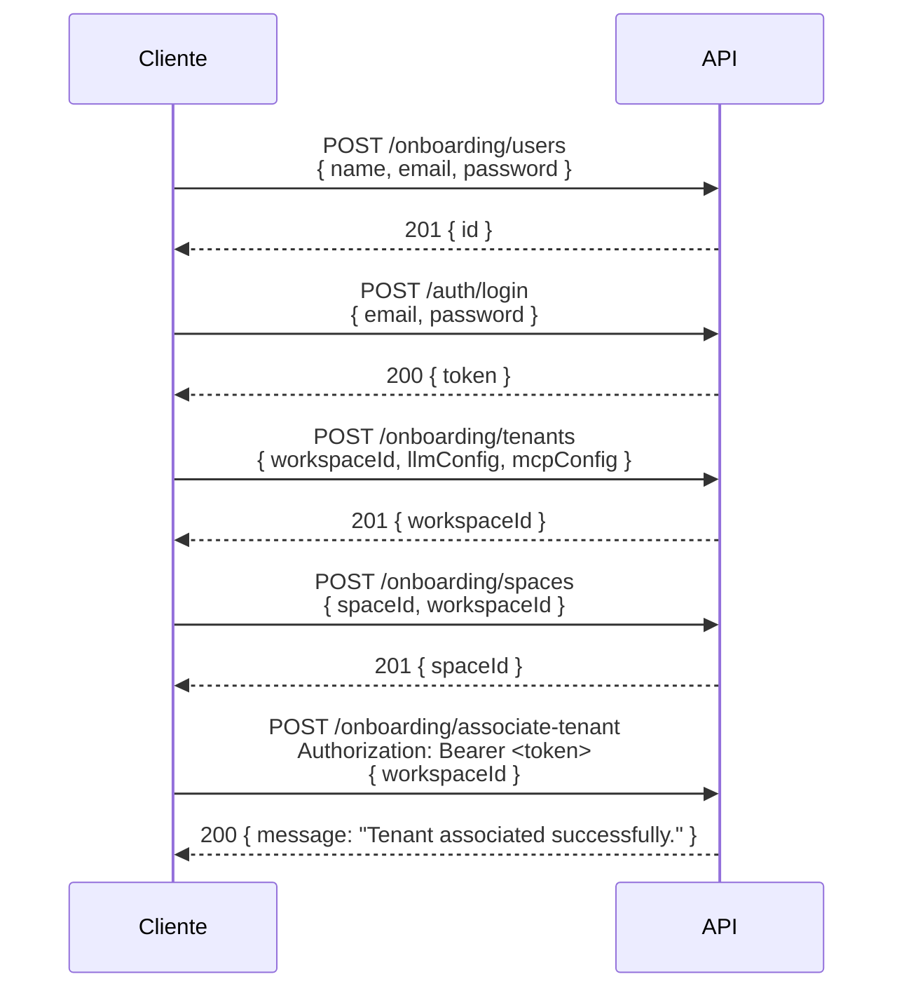
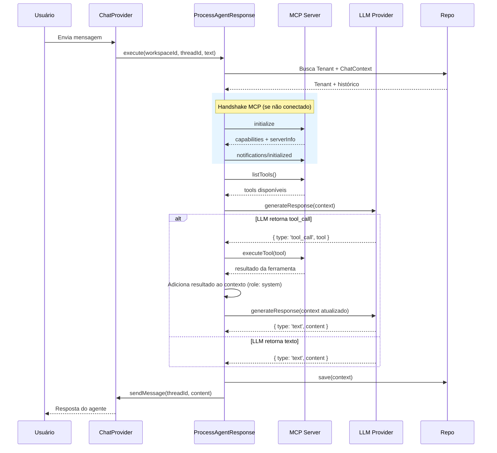

# Support Agent

Agente de suporte inteligente baseado em LLMs (Large Language Models) com integração ao protocolo MCP (Model Context Protocol) para execução dinâmica de ferramentas. O sistema segue princípios de **Clean Architecture / Hexagonal Architecture** para garantir desacoplamento entre a lógica de negócio e os provedores de infraestrutura.

---

## Índice

- [Visão Geral](#visão-geral)
- [Arquitetura](#arquitetura)
- [Estrutura de Diretórios](#estrutura-de-diretórios)
- [Camadas](#camadas)
  - [Domain](#domain)
  - [Ports (Interfaces)](#ports-interfaces)
  - [Infrastructure](#infrastructure)
  - [Repositories](#repositories)
  - [Use Cases](#use-cases)
- [API Layer](#api-layer)
- [Autenticação e Autorização (JWT)](#autenticação-e-autorização-jwt)
- [Onboarding](#onboarding)
- [Multi-Tenant](#multi-tenant)
- [Provedores LLM Suportados](#provedores-llm-suportados)
- [Integração MCP](#integração-mcp)
- [Integração Slack](#integração-slack)
- [Fluxo de Processamento](#fluxo-de-processamento)
- [Stack Tecnológica](#stack-tecnológica)
- [Pré-requisitos](#pré-requisitos)
- [Instalação](#instalação)
- [Configuração](#configuração)
- [Status do Projeto](#status-do-projeto)

---

## Visão Geral

O **Support Agent** é um bot de atendimento que atua como intermediário entre o usuário final e sistemas internos. Ele utiliza LLMs para interpretar perguntas em linguagem natural e, quando necessário, invoca ferramentas externas via MCP para buscar dados concretos (logs, base de conhecimento, etc.) antes de formular uma resposta final.

**Principais capacidades:**

- 🤖 Processamento de linguagem natural via múltiplos provedores de LLM
- 🔧 Descoberta e execução dinâmica de ferramentas via MCP (JSON-RPC 2.0)
- 🔄 Ciclo de decisão agentic: a LLM decide autonomamente se responde diretamente ou se precisa de dados adicionais
- 🏗️ Arquitetura extensível — novos provedores e ferramentas podem ser adicionados sem alterar a lógica central
- 💬 Suporte multi-plataforma de chat: **Google Chat** e **Slack** prontos para uso

---

## Arquitetura

O projeto adota uma arquitetura hexagonal (Ports & Adapters), onde o núcleo de domínio define contratos (interfaces/ports) e a infraestrutura fornece implementações concretas (adapters):

```
┌─────────────────────────────────────────────────────────────────────────────┐
│                             Use Cases                                      │
│                     ProcessAgentResponseUseCase                             │
│                                                                            │
│  ┌──────────────┐  ┌────────────┐  ┌──────────────┐  ┌────────────────┐   │
│  │ ILLMProvider  │  │ IMCPClient │  │ IChatProvider │  │ IQueueService  │   │
│  └──────┬───────┘  └─────┬──────┘  └──────┬───────┘  └───────┬────────┘   │
│         │                │                │                   │            │
└─────────┼────────────────┼────────────────┼───────────────────┼────────────┘
          │                │                │                   │
    ┌─────▼───────┐  ┌─────▼──────┐  ┌─────▼─────────┐   ┌─────▼─────────┐
    │   OpenAI    │  │    MCP     │  │    Google     │   │    QStash     │
    │   Adapter   │  │   HTTP     │  │  ChatAdapter  │   │   Adapter     │
    ├─────────────┤  │  Adapter   │  ├───────────────┤   └───────────────┘
    │  Anthropic  │  └────────────┘  │    Slack      │
    │   Adapter   │                  │  ChatAdapter  │
    ├─────────────┤                  └───────────────┘
    │   DeepSeek  │
    │(via OpenAI) │
    └─────────────┘
```

---

## Estrutura de Diretórios

```
support-agent/
├── src/
│   ├── domain/                          # Núcleo de domínio (entidades + regras de negócio)
│   │   ├── ChatContext.ts               # Contexto de conversação (thread + mensagens)
│   │   ├── LLMConfig.ts                # Tipagem de configuração do provedor LLM
│   │   ├── MCPServerCapabilities.ts     # Tipos do handshake MCP
│   │   ├── Message.ts                  # Entidade de mensagem
│   │   ├── Password.ts                 # Value object — hash SHA-256 na criação, compare em login
│   │   ├── SpaceMapping.ts             # Mapeamento spaceId → workspaceId
│   │   ├── Tenant.ts                   # Entidade de tenant (workspaceId, llmConfig, mcpConfig)
│   │   ├── ToolCall.ts                 # Entidade de chamada de ferramenta
│   │   ├── User.ts                     # Entidade de usuário (id, name, email, password, role)
│   │   └── ports/                      # Interfaces (contratos de fronteira)
│   │       ├── IChatProvider.ts
│   │       ├── IChatRepository.ts
│   │       ├── ILLMProvider.ts
│   │       ├── IMCPClient.ts
│   │       ├── IQueueService.ts
│   │       ├── ISpaceMappingRepository.ts
│   │       ├── ITenantRepository.ts
│   │       └── IUserRepository.ts
│   │
│   ├── infrastructure/                  # Implementações concretas dos ports
│   │   ├── chat/
│   │   │   ├── GoogleChatAdapter.ts
│   │   │   └── SlackChatAdapter.ts
│   │   ├── database/
│   │   │   └── MongoConnection.ts
│   │   ├── llm/
│   │   │   ├── AnthropicAdapter.ts
│   │   │   ├── OpenAIAdapter.ts
│   │   │   └── LLMFactory.ts
│   │   ├── mcp/
│   │   │   └── MCPHttpAdapter.ts
│   │   └── queue/
│   │       └── QStashAdapter.ts
│   │
│   ├── repositories/                    # Implementações concretas dos repositórios
│   │   ├── ChatRepository.ts
│   │   ├── SpaceMappingRepository.ts    # Coleção space_mappings
│   │   ├── TenantRepository.ts
│   │   └── UserRepository.ts           # Coleção users
│   │
│   ├── usecases/                        # Orquestração de lógica de aplicação
│   │   ├── AssociateTenantToUserUseCase.ts
│   │   ├── LoginUserUseCase.ts
│   │   ├── ProcessAgentResponseUseCase.ts
│   │   ├── RegisterSpaceUseCase.ts
│   │   ├── RegisterTenantUseCase.ts
│   │   └── RegisterUserUseCase.ts
│   │
│   ├── api/
│   │   ├── middlewares/
│   │   │   └── authMiddleware.ts        # Valida Bearer JWT e injeta req.user
│   │   ├── types/
│   │   │   └── express.d.ts            # Module augmentation — tipagem de req.user
│   │   ├── authRouter.ts               # POST /api/auth/login
│   │   ├── onboardingRouter.ts         # POST /api/onboarding/*
│   │   ├── slackRouter.ts              # POST /api/slack/events
│   │   ├── webhookRouter.ts
│   │   └── workerRouter.ts
│   │
│   ├── config/
│   │   └── container.ts               # Composition Root
│   │
│   ├── controllers/
│   │   ├── AuthController.ts
│   │   ├── ChatWebhookController.ts
│   │   ├── OnboardingController.ts
│   │   ├── SlackWebhookController.ts
│   │   └── WorkerController.ts
│   │
│   ├── app.ts
│   └── index.ts
│
├── api/
│   └── index.ts                       # Entry point para Vercel Serverless Functions
├── package.json
├── vercel.json
├── .env.example
└── README.md
```

---

## Camadas

### Domain

Contém as entidades centrais e as regras de negócio do sistema. Não possui dependência de nenhuma biblioteca externa.

| Entidade | Descrição |
|---|---|
| `Message` | Representa uma mensagem individual com `id`, `role` (user/assistant/system), `content` e `timestamp`. |
| `ChatContext` | Agrupa um `threadID`, `workspaceId` e o histórico de `Message[]`. |
| `Tenant` | Workspace configurado com `workspaceId`, `llmConfig`, `mcpConfig` e `isActive`. |
| `User` | Usuário do sistema com `id`, `name`, `email`, `password` (value object) e `workspaceId: string[]`. |
| `Password` | Value object que encapsula senha hasheada (SHA-256). Criado via `Password.create(plain)` no entry point; comparado via `password.compare(plain)` no login. |
| `SpaceMapping` | Mapeia um `spaceId` do Google Chat ao `workspaceId` do tenant correspondente. |
| `ToolCall` | Requisição de execução de ferramenta com `name` e `parameters`. |
| `LLMConfig` | Interface com `provider`, `apiKey` e `model` opcional. Suporta: `openai`, `anthropic`, `google`, `deepseek`. |

### Ports (Interfaces)

Contratos que definem as fronteiras do domínio — implementados pela camada de infraestrutura.

| Port | Responsabilidade |
|---|---|
| `ILLMProvider` | Gera respostas a partir do `ChatContext`. Retorna `{ type: 'text' }` ou `{ type: 'tool_call' }`. |
| `IMCPClient` | Handshake MCP, listagem e execução de ferramentas. |
| `IChatProvider` | Envia mensagens ao canal de chat do usuário final. |
| `IQueueService` | Despacha tarefas para processamento assíncrono. |
| `IChatRepository` | Persiste e recupera `ChatContext` por `threadId` + `workspaceId`. |
| `ITenantRepository` | Persiste e recupera `Tenant` por `workspaceId`. |
| `ISpaceMappingRepository` | Persiste e recupera mapeamentos `spaceId → workspaceId`. |
| `IUserRepository` | Persiste e recupera `User` por `id` ou `email`; adiciona `workspaceId` ao array. |

### Infrastructure

Implementações concretas dos ports:

#### LLM Adapters

- **`OpenAIAdapter`** — Integra com a API da OpenAI (Chat Completions). Também suporta provedores compatíveis via `baseURL` customizada (ex: DeepSeek). Trata a tradução bidirecional entre o domínio e o formato proprietário da API.
- **`AnthropicAdapter`** — Integra com a API da Anthropic (Messages). Separa system prompts das mensagens de conversa conforme o padrão da API do Claude. Mapeia blocos `tool_use` para a entidade `ToolCall` do domínio.
- **`LLMFactory`** — Factory Method que instancia o adapter correto com base no `LLMConfig.provider`. Modelos padrão:
  - `openai` → `gpt-4o`
  - `deepseek` → `deepseek-chat` (via `OpenAIAdapter` com `baseURL` customizada)
  - `anthropic` → `claude-3-5-sonnet`

#### MCP Adapter

- **`MCPHttpAdapter`** — Cliente HTTP que se comunica com um servidor MCP via JSON-RPC 2.0. Implementa o handshake completo conforme a especificação MCP:
  - `connect()` — Handshake em 3 etapas: envia `initialize`, recebe capabilities do servidor, envia `notifications/initialized`
  - `isConnected()` — Verifica se o handshake foi concluído
  - `tools/list` — Descobre dinamicamente as ferramentas disponíveis para o tenant
  - `tools/call` — Executa uma ferramenta específica passando nome e argumentos
  - `ensureInitialized()` — Conecta automaticamente se o handshake ainda não foi realizado

#### Chat Adapters

- **`GoogleChatAdapter`** — Envia mensagens para uma thread do Google Chat Spaces via API REST v1. Utiliza `google-auth-library` para autenticação OAuth2 via Application Default Credentials (ADC). O `threadId` é usado no formato `spaces/AAAAxxxx/threads/YYYYyyyy`.
- **`SlackChatAdapter`** — Envia mensagens para um canal/thread do Slack via `chat.postMessage`. Autentica com Bearer token (`SLACK_BOT_TOKEN`). Usa a convenção `"CHANNEL_ID:thread_ts"` para o `threadId`, permitindo respostas dentro da thread correta sem quebrar a interface `IChatProvider`.

#### Queue Adapter

- **`QStashAdapter`** — Despacha mensagens para processamento assíncrono via QStash (Upstash). Publica no endpoint `https://qstash.upstash.io/v1/publish/{workerUrl}` com header `Upstash-Retries: 3` para retentativas automáticas.

#### Database

- **`MongoConnection`** — Singleton que gerencia a conexão com MongoDB. Método `connect(uri, dbName)` inicia a conexão; `getDb()` retorna a instância do banco para consumo dos repositórios.

### Repositories

Implementações concretas dos ports de repositório utilizando MongoDB:

| Repositório | Coleção | Operações |
|---|---|---|
| `ChatRepository` | `threads` | `findById`, `save` |
| `TenantRepository` | `tenants` | `findByWorkspaceId`, `save` |
| `UserRepository` | `users` | `findById`, `findByEmail`, `save`, `addWorkspaceId` |
| `SpaceMappingRepository` | `space_mappings` | `findBySpaceId`, `save` |

### Use Cases

| Use Case | Descrição |
|---|---|
| `ProcessAgentResponseUseCase` | Fluxo principal do agente: resolve tenant via `spaceId`, executa ciclo LLM→MCP→LLM e persiste o contexto. |
| `RegisterUserUseCase` | Cria um novo usuário. Valida unicidade do email e aplica `Password.create()` antes de persistir. |
| `LoginUserUseCase` | Valida credenciais e emite um JWT assinado com `jose` (HS256). Expõe `verify()` estático para o middleware. |
| `RegisterTenantUseCase` | Registra um novo tenant (workspace). Valida duplicidade de `workspaceId`. |
| `RegisterSpaceUseCase` | Registra um espaço do Google Chat e associa ao tenant via `workspaceId`. Exige que o tenant exista. |
| `AssociateTenantToUserUseCase` | Vincula um `workspaceId` de tenant a um usuário existente via `addWorkspaceId()`. |

---

## Autenticação e Autorização (JWT)

O sistema utiliza **JWT (JSON Web Tokens)** assinados com HS256 via biblioteca [`jose`](https://github.com/panva/jose) (ESM-native, compatível com `"type": "module"`).

### Fluxo de Autenticação

```
POST /api/auth/login
  → valida email + senha (SHA-256)
  → emite JWT com payload { sub, email, workspaceIds }
  → token expira conforme JWT_EXPIRES_IN (padrão: 8h)
```

### Middleware

O `authMiddleware` extrai o Bearer token do header `Authorization`, verifica a assinatura com `jose` e injeta `req.user` na request:

```typescript
// req.user após validação
{
  sub: string;         // user id
  email: string;
  workspaceIds: string[];
}
```

Rotas protegidas retornam `401` se o token estiver ausente, inválido ou expirado.

### Variáveis de Ambiente

```env
JWT_SECRET=sua_chave_secreta_aqui   # mínimo 32 caracteres recomendado
JWT_EXPIRES_IN=8h                   # aceita: 8h | 1d | 7d | etc.
```

---

## Onboarding

O fluxo de onboarding configura o agente para um novo cliente em 4 etapas independentes.

### Endpoints

| Método | Rota | Auth | Descrição |
|---|---|---|---|
| `POST` | `/api/auth/login` | Público | Autentica e retorna JWT |
| `POST` | `/api/onboarding/users` | Público | Cria usuário (sem tenant) |
| `POST` | `/api/onboarding/tenants` | Público | Registra tenant (workspace Google) |
| `POST` | `/api/onboarding/spaces` | Público | Registra espaço Google Chat |
| `POST` | `/api/onboarding/associate-tenant` | 🔒 JWT | Vincula tenant ao usuário autenticado |

### Fluxo Recomendado



### Payloads de Exemplo

**Criar usuário**
```json
POST /api/onboarding/users
{
  "name": "Luis Felix",
  "email": "luis@empresa.com",
  "password": "senha123"
}
```

**Registrar tenant**
```json
POST /api/onboarding/tenants
{
  "workspaceId": "spaces/AAAAxxxx",
  "llmConfig": {
    "provider": "openai",
    "apiKey": "sk-...",
    "model": "gpt-4o"
  },
  "mcpConfig": {
    "url": "https://mcp.example.com",
    "apiKey": "mcp-key-..."
  }
}
```

**Registrar espaço Google Chat**
```json
POST /api/onboarding/spaces
{
  "spaceId": "spaces/AAAAxxxx",
  "workspaceId": "spaces/AAAAxxxx"
}
```

**Associar tenant ao usuário** *(requer Bearer token)*
```json
POST /api/onboarding/associate-tenant
Authorization: Bearer <jwt>

{
  "workspaceId": "spaces/AAAAxxxx"
}
```

### Respostas de Erro

| Código | Situação |
|---|---|
| `400` | Campos obrigatórios ausentes |
| `401` | Token JWT ausente ou inválido |
| `404` | Tenant ou usuário não encontrado |
| `409` | Email ou `workspaceId` já cadastrado |
| `500` | Erro interno |

---

## Multi-Tenant

Cada workspace do Google Chat é tratado como um **tenant independente**. As configurações de LLM (provedor, modelo, chave de API) e MCP (URL do servidor, chave de API) são armazenadas por tenant no MongoDB (coleção `tenants`).

### Estrutura do Documento Tenant

```json
{
  "workspaceId": "spaces/AAAAxxxx",
  "llmConfig": {
    "provider": "openai",
    "apiKey": "sk-...",
    "model": "gpt-4o"
  },
  "mcpConfig": {
    "url": "https://mcp.example.com",
    "apiKey": "..."
  },
  "isActive": true
}
```

- O campo `isActive` permite desativar o bot para um tenant sem remover seus dados
- O `ProcessAgentResponseUseCase` busca o tenant dinamicamente a cada requisição
- Provedores LLM e MCP são instanciados sob demanda — não há dependência fixa do container global

---

## Provedores LLM Suportados

| Provedor | Adapter | Modelo Padrão | Observações |
|---|---|---|---|
| **OpenAI** | `OpenAIAdapter` | `gpt-4o` | API oficial OpenAI |
| **DeepSeek** | `OpenAIAdapter` | `deepseek-chat` | Usa a mesma interface da OpenAI com `baseURL` customizada |
| **Anthropic** | `AnthropicAdapter` | `claude-3-5-sonnet` | Tratamento separado de system prompt + mapeamento de `tool_use` blocks |
| **Google** | — | — | Tipo declarado em `LLMConfig`, adapter ainda não implementado |

---

## Integração MCP

A comunicação com o servidor MCP segue o protocolo **JSON-RPC 2.0** sobre HTTP. Antes de qualquer operação, o cliente executa um **handshake de 3 etapas**:

```jsonc
// Etapa 1 — Client → Server: initialize (request com id)
{
  "jsonrpc": "2.0",
  "id": 1,
  "method": "initialize",
  "params": {
    "protocolVersion": "2025-03-26",
    "capabilities": {},
    "clientInfo": { "name": "support-agent", "version": "1.0.0" }
  }
}

// Etapa 2 — Server → Client: resposta com capabilities e serverInfo

// Etapa 3 — Client → Server: notifications/initialized (notification sem id)
{
  "jsonrpc": "2.0",
  "method": "notifications/initialized"
}
```

Após o handshake, as operações regulares podem ser executadas:

```jsonc
// Listar ferramentas
{ "jsonrpc": "2.0", "id": 2, "method": "tools/list" }

// Executar ferramenta
{
  "jsonrpc": "2.0",
  "id": 3,
  "method": "tools/call",
  "params": {
    "name": "query_loki_logs",
    "arguments": { "query": "{app=\"api\"}", "since_minutes": 30 }
  }
}
```

O adapter trata respostas de erro HTTP (401, 403, 429) e erros no nível JSON-RPC (`data.error`). Caso `listTools()` ou `executeTool()` sejam chamados sem `connect()` prévio, o adapter executa o handshake automaticamente.

---

## Integração Slack

O Support Agent suporta o **Slack** como plataforma de chat. A integração utiliza a [Slack Events API](https://api.slack.com/events) para receber mensagens e a [Web API](https://api.slack.com/web) (`chat.postMessage`) para enviar respostas.

### Segurança — Verificação de Assinatura

Todo request do Slack inclui o header `x-slack-signature` (HMAC-SHA256). O `SlackWebhookController` valida esse header usando o `SLACK_SIGNING_SECRET` antes de processar qualquer evento:

```
Sig base string: "v0:{timestamp}:{rawBody}"
HMAC-SHA256 → comparação com timingSafeEqual (anti timing-attack)
Timestamp > 5 min → rejeitado (anti replay-attack)
```

### Endpoint

```
POST /api/slack/events
```

### Fluxo de Eventos

| Tipo de evento | Comportamento |
|---|---|
| `url_verification` | Responde com `{ challenge }` imediatamente (instalação do app) |
| `event_callback` com `message` | Valida assinatura → filtra bots → enfileira no QStash |
| Mensagem com `bot_id` ou `subtype: bot_message` | Ignorada (evita loops) |

### Convenção de `threadId`

A interface `IChatProvider.sendMessage(threadId, content)` é agnóstica à plataforma. Para o Slack, `threadId` é codificado como `"CHANNEL_ID:thread_ts"` pelo controller e decodificado pelo adapter ao enviar.

### Como Configurar o App no Slack

1. Acesse [api.slack.com/apps](https://api.slack.com/apps) → **Create New App**
2. Em **Event Subscriptions**, habilite e defina a **Request URL**: `https://<seu-dominio>/api/slack/events`
3. Adicione o evento `message.channels` (canais) ou `message.im` (DMs)
4. Em **OAuth & Permissions**, adicione o scope `chat:write` e instale o app
5. Copie o **Bot User OAuth Token** (`xoxb-...`) → `SLACK_BOT_TOKEN`
6. Em **Basic Information > App Credentials**, copie o **Signing Secret** → `SLACK_SIGNING_SECRET`

### Variáveis de Ambiente

```env
SLACK_BOT_TOKEN=xoxb-...          # Bot token (começa com xoxb-)
SLACK_SIGNING_SECRET=...           # Signing Secret do app
```

### Troubleshooting — `challenge_failed` no Event Subscriptions

Ao cadastrar a **Request URL** no painel do Slack, o Slack envia um POST com o seguinte body para verificar o endpoint:

```json
{
  "type": "url_verification",
  "token": "...",
  "challenge": "..."
}
```

O endpoint deve responder imediatamente com `{ "challenge": "<valor>" }`. Se o Slack retornar o erro `challenge_failed` com o body da resposta vazio `{}`, a causa mais comum em deploys na **Vercel** é o **body parser automático da plataforma**.

**Causa raiz:** A Vercel consome o stream do body da requisição antes de repassar o request ao handler Express. Com o stream já lido, o `express.json()` não consegue parsear o body, fazendo com que `req.body` fique `{}`. Sem o body, o `SlackWebhookController` não identifica `payload.type === 'url_verification'` e falha em retornar o `challenge`.

**Correção aplicada em `api/index.ts`:**

```typescript
// Desabilita o body parser automático da Vercel.
// Sem isso, req.body fica {} e o url_verification falha com challenge_failed.
export const config = {
    api: {
        bodyParser: false,
    },
};

export default app;
```

Isso garante que o `express.json()` (configurado em `app.ts` com o callback `verify` que captura `req.rawBody`) seja o único responsável pelo parsing — necessário tanto para o `url_verification` quanto para a validação de assinatura HMAC-SHA256 dos eventos subsequentes.

---

## Fluxo de Processamento



---

## Stack Tecnológica

| Tecnologia | Versão | Função |
|---|---|---|
| **TypeScript** | 6.x | Linguagem principal |
| **Node.js** | ≥ 20 | Runtime (ESM nativo) |
| **OpenAI SDK** | ^6.45.0 | Client para APIs compatíveis com OpenAI |
| **Anthropic SDK** | ^0.110.0 | Client para API da Anthropic |
| **google-auth-library** | ^10.9.0 | Autenticação OAuth2 para Google APIs |
| **Express** | ^5.2.1 | Framework HTTP |
| **helmet** | ^8.2.0 | Segurança HTTP (headers) |
| **cors** | ^2.8.6 | Liberação de CORS |
| **dotenv** | ^17.4.2 | Variáveis de ambiente em dev |
| **MongoDB Driver** | ^7.4.0 | Driver nativo MongoDB |
| **jose** | ^6.x | JWT ESM-native (assinar e verificar tokens HS256) |
| **tsx** | ^4.23.0 | Execução direta de TypeScript em dev |
| **Vitest** | ^4.1.10 | Runner de testes unitários |
| **@vitest/coverage-v8** | ^4.1.10 | Relatório de cobertura de código |

### Scripts

| Comando | Descrição |
|---|---|
| `npm run dev` | Desenvolvimento com hot-reload (`tsx watch src/index.ts`) |
| `npm run build` | Compilação TypeScript (`tsc`) |
| `npm start` | Execução do build compilado (`node dist/index.js`) |
| `npm test` | Executa testes unitários (`vitest run`) |
| `npm run test:watch` | Modo watch (`vitest`) |
| `npm run test:coverage` | Relatório de cobertura (`vitest run --coverage`) |

---

## Testes

O projeto utiliza **Vitest** como framework de testes. Os testes estão organizados lado a lado com o código-fonte (`*.test.ts`) seguindo o padrão de co-locação.

### Cobertura

| Camada | Arquivos testados | Testes |
|---|---|---|
| Domínio | `Password` | 11 |
| Infraestrutura | `GoogleChatAdapter`, `MCPHttpAdapter`, `SlackChatAdapter` | 26 |
| Controllers | `SlackWebhookController` | 9 |
| Use Cases | Todos os 6 use cases | 29 |
| **Total** | **12 arquivos** | **75** |

### Estrutura

```
src/
├── domain/
│   └── Password.test.ts
├── infrastructure/
│   ├── chat/
│   │   ├── GoogleChatAdapter.test.ts
│   │   └── SlackChatAdapter.test.ts
│   └── mcp/
│       └── MCPHttpAdapter.test.ts
├── controllers/
│   └── SlackWebhookController.test.ts
└── usecases/
    ├── AssociateTenantToUserUseCase.test.ts
    ├── LoginUserUseCase.test.ts
    ├── ProcessAgentResponseUseCase.test.ts
    ├── RegisterSpaceUseCase.test.ts
    ├── RegisterTenantUseCase.test.ts
    └── RegisterUserUseCase.test.ts
```

### Práticas

- **Mocks**: repositórios mockados com `vi.fn()`, HTTP global mockado com `vi.stubGlobal('fetch', ...)`, JWT testado com `process.env` temporário
- **Isolamento**: sem dependência de banco de dados ou serviços externos
- **Factory functions**: funções reutilizáveis (`makeUserRepo`, `makeTenantRepo`, etc.) para criar mocks tipados
- **Cobertura**: configurada com `@vitest/coverage-v8` nos diretórios `usecases`, `infrastructure` e `domain`

### CI/CD

O pipeline do **GitHub Actions** (`.github/workflows/ci-cd.yml`) executa `npm test` em todo PR para a branch `main`. Após o merge, faz deploy automático na Vercel.

---

## Pré-requisitos

- **Node.js** ≥ 20.x
- **npm** ≥ 10.x
- **MongoDB** ≥ 6.x (local ou Atlas) — para persistência de conversas e tenants
- Chaves de API para pelo menos um provedor LLM (OpenAI, Anthropic ou DeepSeek)
- URL de um servidor MCP ativo (para integração com ferramentas)
- Google Cloud service account com escopo `chat.messages.create` (para Google Chat)
- Token de API do **QStash (Upstash)** e URL pública de um worker (para fila assíncrona)

---

## Instalação e Execução

```bash
# Clonar o repositório
git clone https://github.com/luisfelix-93/support-agent support-agent
cd support-agent

# Instalar dependências
npm install

# Configurar variáveis de ambiente
cp .env.example .env
# (Edite o arquivo .env com suas chaves)

# Iniciar servidor local
npm run dev
```

---

## Configuração e Injeção de Dependências

O sistema utiliza um **Composition Root** (`src/config/container.ts`) para injetar todas as dependências automaticamente usando variáveis de ambiente. Você não precisa instanciar os adapters manualmente.

As configurações são carregadas via `dotenv` no ambiente local, e injetadas pela Vercel no ambiente de produção.

Variáveis essenciais (`.env`):
- `PORT`: Porta do servidor local (ex: 3000)
- `MONGODB_URI` e `MONGODB_DB_NAME`: Conexão com MongoDB
- `QSTASH_TOKEN` e `WORKER_URL`: Integração com Upstash (filas assíncronas)
- `MCP_SERVER_URL` e `MCP_API_KEY`: Comunicação com o servidor MCP
- `LLM_PROVIDER`, `LLM_API_KEY` e `LLM_MODEL`: Configurações de LLM
- `JWT_SECRET`: Chave secreta para assinar tokens JWT (mínimo 32 caracteres recomendado)
- `JWT_EXPIRES_IN`: Tempo de expiração do token (ex: `8h`, `1d`, `7d`)
- `SLACK_BOT_TOKEN`: Bot token do app Slack (começa com `xoxb-`)
- `SLACK_SIGNING_SECRET`: Signing secret para validação de assinatura HMAC-SHA256

A arquitetura foi adaptada para rodar de forma stateless via **Vercel Serverless Functions**. O request cycle é tratado no Express (`src/app.ts`), que é servido localmente via `src/index.ts` e exportado para a Vercel através de `api/index.ts`.

---

## Status do Projeto

> 🚧 **Em desenvolvimento ativo**

| Componente | Status |
|---|---|
| Entidades de domínio | ✅ Implementado |
| Ports / Interfaces | ✅ Implementado |
| OpenAI Adapter | ✅ Implementado |
| Anthropic Adapter | ✅ Implementado |
| DeepSeek (via OpenAI) | ✅ Implementado |
| Google LLM Adapter | ⬜ Pendente |
| MCP HTTP Adapter | ✅ Implementado |
| ChatProvider Adapter (Google Chat) | ✅ Implementado |
| ChatProvider Adapter (Slack) | ✅ Implementado |
| QueueService Adapter (QStash) | ✅ Implementado |
| MongoDB Connection | ✅ Implementado |
| ChatRepository | ✅ Implementado |
| TenantRepository | ✅ Implementado |
| UserRepository | ✅ Implementado |
| SpaceMappingRepository | ✅ Implementado |
| Multi-tenant no Use Case | ✅ Implementado |
| Express App (`app.ts`) | ✅ Implementado |
| Composition Root (`container.ts`) | ✅ Implementado |
| Controllers (Webhook + Worker) | ✅ Implementado |
| Slack Webhook Controller + Router | ✅ Implementado |
| Onboarding Controllers + Routers | ✅ Implementado |
| Auth Controller + Router (Login) | ✅ Implementado |
| JWT Middleware (`authMiddleware`) | ✅ Implementado |
| Entry point dev (`index.ts`) | ✅ Implementado |
| Entry point Vercel (`api/index.ts`) | ✅ Implementado |
| Deploy Serverless (Vercel) | ✅ Implementado |
| Testes unitários | ✅ Implementado |
| Pipeline CI/CD (GitHub Actions) | ✅ Implementado |

---

## Licença

ISC
