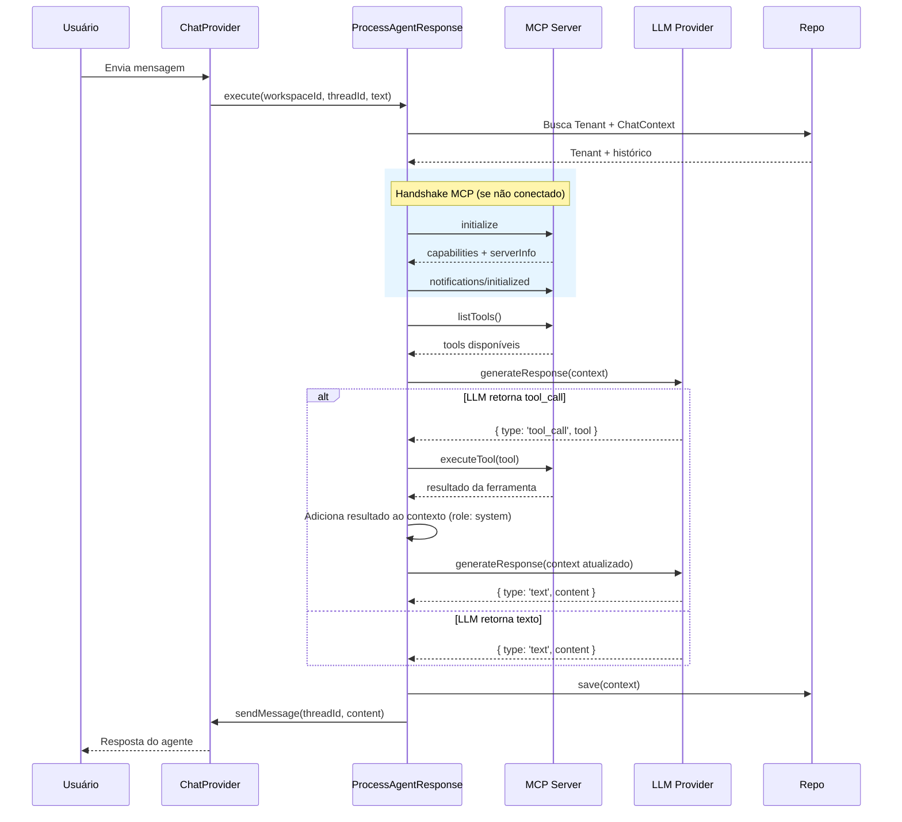

# Support Agent

Agente de suporte inteligente baseado em LLMs (Large Language Models) com integração ao protocolo MCP (Model Context Protocol) para execução dinâmica de ferramentas. O sistema segue princípios de **Clean Architecture / Hexagonal Architecture** para garantir desacoplamento entre a lógica de negócio e os provedores de infraestrutura.

---

## Índice

- [Visão Geral](#visão-geral)
- [Arquitetura](#arquitetura)
- [Estrutura de Diretórios](#estrutura-de-diretórios)
- [Camadas](#camadas)
  - [Domain](#domain)
  - [Ports (Interfaces)](#ports-interfaces)
  - [Infrastructure](#infrastructure)
  - [Repositories](#repositories)
  - [Use Cases](#use-cases)
- [API Layer](#api-layer)
- [Multi-Tenant](#multi-tenant)
- [Provedores LLM Suportados](#provedores-llm-suportados)
- [Integração MCP](#integração-mcp)
- [Fluxo de Processamento](#fluxo-de-processamento)
- [Stack Tecnológica](#stack-tecnológica)
- [Pré-requisitos](#pré-requisitos)
- [Instalação](#instalação)
- [Configuração](#configuração)
- [Status do Projeto](#status-do-projeto)

---

## Visão Geral

O **Support Agent** é um bot de atendimento que atua como intermediário entre o usuário final e sistemas internos. Ele utiliza LLMs para interpretar perguntas em linguagem natural e, quando necessário, invoca ferramentas externas via MCP para buscar dados concretos (logs, base de conhecimento, etc.) antes de formular uma resposta final.

**Principais capacidades:**

- 🤖 Processamento de linguagem natural via múltiplos provedores de LLM
- 🔧 Descoberta e execução dinâmica de ferramentas via MCP (JSON-RPC 2.0)
- 🔄 Ciclo de decisão agentic: a LLM decide autonomamente se responde diretamente ou se precisa de dados adicionais
- 🏗️ Arquitetura extensível — novos provedores e ferramentas podem ser adicionados sem alterar a lógica central

---

## Arquitetura

O projeto adota uma arquitetura hexagonal (Ports & Adapters), onde o núcleo de domínio define contratos (interfaces/ports) e a infraestrutura fornece implementações concretas (adapters):

```
┌─────────────────────────────────────────────────────────────────────────────┐
│                             Use Cases                                      │
│                     ProcessAgentResponseUseCase                             │
│                                                                            │
│  ┌──────────────┐  ┌────────────┐  ┌──────────────┐  ┌────────────────┐   │
│  │ ILLMProvider  │  │ IMCPClient │  │ IChatProvider │  │ IQueueService  │   │
│  └──────┬───────┘  └─────┬──────┘  └──────┬───────┘  └───────┬────────┘   │
│         │                │                │                   │            │
└─────────┼────────────────┼────────────────┼───────────────────┼────────────┘
          │                │                │                   │
    ┌─────▼───────┐  ┌─────▼──────┐  ┌─────▼─────────┐   ┌─────▼─────────┐
    │   OpenAI    │  │    MCP     │  │    Google     │   │    QStash     │
    │   Adapter   │  │   HTTP     │  │  ChatAdapter  │   │   Adapter     │
    ├─────────────┤  │  Adapter   │  └───────────────┘   └───────────────┘
    │  Anthropic  │  └────────────┘
    │   Adapter   │
    ├─────────────┤
    │   DeepSeek  │
    │(via OpenAI) │
    └─────────────┘
```

---

## Estrutura de Diretórios

```
support-agent/
├── src/
│   ├── domain/                     # Núcleo de domínio (entidades + regras de negócio)
│   │   ├── ChatContext.ts          # Contexto de conversação (thread + mensagens)
│   │   ├── LLMConfig.ts           # Tipagem de configuração do provedor LLM
│   │   ├── MCPServerCapabilities.ts # Tipos do handshake MCP (ServerInfo, Capabilities, InitializeResult)
│   │   ├── Message.ts             # Entidade de mensagem (id, role, content, timestamp)
│   │   ├── Tenant.ts             # Entidade de tenant (workspaceId, llmConfig, mcpConfig, isActive)
│   │   ├── ToolCall.ts            # Entidade de chamada de ferramenta (name, parameters)
│   │   └── ports/                 # Interfaces (contratos de fronteira)
│   │       ├── IChatProvider.ts   # Port para envio de mensagens ao canal de chat
│   │       ├── IChatRepository.ts # Port para persistência do ChatContext
│   │       ├── ILLMProvider.ts    # Port para geração de respostas via LLM
│   │       ├── IMCPClient.ts      # Port para comunicação com servidor MCP
│   │       ├── IQueueService.ts   # Port para processamento assíncrono (filas)
│   │       └── ITenantRepository.ts # Port para persistência de tenants
│   │
│   ├── infrastructure/            # Implementações concretas dos ports
│   │   ├── chat/                  # Adapters de provedores de chat
│   │   │   └── GoogleChatAdapter.ts   # Envio de mensagens via Google Chat Spaces API
│   │   ├── database/              # Conexão com banco de dados
│   │   │   └── MongoConnection.ts # Singleton de conexão MongoDB
│   │   ├── llm/                   # Adapters de provedores LLM
│   │   │   ├── AnthropicAdapter.ts    # Implementação para Claude (Anthropic)
│   │   │   ├── OpenAIAdapter.ts       # Implementação para GPT / DeepSeek
│   │   │   └── LLMFactory.ts         # Factory para criação do provider correto
│   │   ├── mcp/                   # Adapter de comunicação MCP
│   │   │   └── MCPHttpAdapter.ts  # Cliente HTTP JSON-RPC 2.0 para servidor MCP
│   │   └── queue/                 # Adapters de provedores de fila
│   │       └── QStashAdapter.ts   # Despacho assíncrono via QStash (Upstash)
│   │
│   ├── repositories/              # Implementações concretas dos repositórios
│   │   ├── ChatRepository.ts      # Persistência do ChatContext no MongoDB (coleção threads)
│   │   └── TenantRepository.ts    # Persistência de tenants no MongoDB (coleção tenants)
│   │
│   └── usecases/                  # Orquestração de lógica de aplicação
│       └── ProcessAgentResponseUseCase.ts  # Fluxo principal do agente
│
│   ├── api/                           # Router factories do Express
│   │   ├── webhookRouter.ts           # Rota para webhook do Google Chat
│   │   └── workerRouter.ts            # Rota para worker do QStash
│   │
│   ├── config/                        # Configurações gerais
│   │   └── container.ts               # Composition Root (Injeção de dependências)
│   │
│   ├── controllers/                   # Controllers da aplicação
│   │   ├── ChatWebhookController.ts
│   │   └── WorkerController.ts
│   │
│   ├── app.ts                         # Instância e middlewares do Express
│   └── index.ts                       # Entry point local (dev)
│
├── api/
│   └── index.ts                       # Entry point para Vercel Serverless Functions
├── package.json
├── vercel.json                        # Configurações de rotas Vercel
├── .env.example                       # Variáveis de ambiente
└── README.md
```

---

## Camadas

### Domain

Contém as entidades centrais e as regras de negócio do sistema. Não possui dependência de nenhuma biblioteca externa.

| Entidade | Descrição |
|---|---|---|
| `Message` | Representa uma mensagem individual com `id`, `role` (user/assistant/system), `content` e `timestamp`. |
| `ChatContext` | Agrupa um `threadID`, `workspaceId` e o histórico de `Message[]`. Contém lógica para gerenciamento do contexto (ex: futura limitação de tokens). |
| `Tenant` | Representa um workspace/tenant com `workspaceId`, `llmConfig`, `mcpConfig` e `isActive`. Permite multi-tenant com configurações isoladas. |
| `ToolCall` | Representa uma requisição de execução de ferramenta com `name` e `parameters`. |
| `MCPServerInfo` / `MCPCapabilities` / `MCPInitializeResult` | Tipos do resultado do handshake MCP: identificação do servidor, capacidades suportadas e versão do protocolo negociada. |
| `LLMConfig` | Interface de configuração com `provider`, `apiKey` e `model` opcional. Suporta os tipos: `openai`, `anthropic`, `google`, `deepseek`. |

### Ports (Interfaces)

Contratos que definem as fronteiras do domínio — implementados pela camada de infraestrutura.

| Port | Responsabilidade |
|---|---|---|
| `ILLMProvider` | Gera respostas a partir do `ChatContext`. Retorna um `LLMResponse` discriminado: `{ type: 'text', content }` ou `{ type: 'tool_call', tool }`. |
| `IMCPClient` | Executa o handshake MCP (`connect`), verifica status da conexão (`isConnected`), descobre ferramentas (`listTools`) e executa ferramentas (`executeTool`). |
| `IChatProvider` | Envia mensagens para o canal de chat do usuário final (ex: Slack, WhatsApp, widget web). |
| `IQueueService` | Despacha mensagens para processamento assíncrono via fila (ex: QStash). |
| `IChatRepository` | Persiste e recupera o `ChatContext` (histórico de conversas) por `threadId` + `workspaceId`. |
| `ITenantRepository` | Persiste e recupera configurações de `Tenant` por `workspaceId`. |

### Infrastructure

Implementações concretas dos ports:

#### LLM Adapters

- **`OpenAIAdapter`** — Integra com a API da OpenAI (Chat Completions). Também suporta provedores compatíveis via `baseURL` customizada (ex: DeepSeek). Trata a tradução bidirecional entre o domínio e o formato proprietário da API.
- **`AnthropicAdapter`** — Integra com a API da Anthropic (Messages). Separa system prompts das mensagens de conversa conforme o padrão da API do Claude. Mapeia blocos `tool_use` para a entidade `ToolCall` do domínio.
- **`LLMFactory`** — Factory Method que instancia o adapter correto com base no `LLMConfig.provider`. Modelos padrão:
  - `openai` → `gpt-4o`
  - `deepseek` → `deepseek-chat` (via `OpenAIAdapter` com `baseURL` customizada)
  - `anthropic` → `claude-3-5-sonnet`

#### MCP Adapter

- **`MCPHttpAdapter`** — Cliente HTTP que se comunica com um servidor MCP via JSON-RPC 2.0. Implementa o handshake completo conforme a especificação MCP:
  - `connect()` — Handshake em 3 etapas: envia `initialize`, recebe capabilities do servidor, envia `notifications/initialized`
  - `isConnected()` — Verifica se o handshake foi concluído
  - `tools/list` — Descobre dinamicamente as ferramentas disponíveis para o tenant
  - `tools/call` — Executa uma ferramenta específica passando nome e argumentos
  - `ensureInitialized()` — Conecta automaticamente se o handshake ainda não foi realizado

#### Chat Adapter

- **`GoogleChatAdapter`** — Envia mensagens para uma thread do Google Chat Spaces via API REST v1. Utiliza `google-auth-library` para autenticação OAuth2 via Application Default Credentials (ADC). O `threadId` é usado no formato `spaces/AAAAxxxx/threads/YYYYyyyy`.

#### Queue Adapter

- **`QStashAdapter`** — Despacha mensagens para processamento assíncrono via QStash (Upstash). Publica no endpoint `https://qstash.upstash.io/v1/publish/{workerUrl}` com header `Upstash-Retries: 3` para retentativas automáticas.

#### Database

- **`MongoConnection`** — Singleton que gerencia a conexão com MongoDB. Método `connect(uri, dbName)` inicia a conexão; `getDb()` retorna a instância do banco para consumo dos repositórios.

### Repositories

Implementações concretas dos ports de repositório utilizando MongoDB:

- **`ChatRepository`** — Operações na coleção `threads`:
  - `findById(threadId, workspaceId)` — Busca o histórico da conversa; retorna `ChatContext` vazio se não existir
  - `save(context)` — Upsert do `ChatContext` com mensagens, `updatedAt` e chave composta `{ threadId, workspaceId }`

- **`TenantRepository`** — Operações na coleção `tenants`:
  - `findByWorkspaceId(workspaceId)` — Busca configuração do tenant; retorna `Tenant` hidratado ou `null`
  - `save(tenant)` — Upsert do documento `Tenant`

### Use Cases

- **`ProcessAgentResponseUseCase`** — Orquestra o fluxo completo de um ciclo de atendimento, agora consumindo repositórios e instanciando provedores dinamicamente por tenant:

  **Assinatura:** `execute(workspaceId, threadId, userText): Promise<void>`

  1. Busca o `Tenant` via `TenantRepository` — se inativo, recusa o atendimento
  2. Busca o `ChatContext` via `ChatRepository` (já hidratado com histórico ou vazio)
  3. Adiciona a mensagem do usuário ao contexto
  4. Instancia `LLMFactory` e `MCPHttpAdapter` com as configs do tenant
  5. Ciclo LLM → MCP → LLM:
     - LLM decide entre texto ou tool_call
     - Se tool_call → executa via MCP → adiciona resultado ao contexto → LLM novamente
  6. Adiciona a resposta do assistente ao histórico
  7. Persiste o contexto via `ChatRepository.save()`
  8. Envia a resposta final ao canal de chat

---

## Multi-Tenant

Cada workspace do Google Chat é tratado como um **tenant independente**. As configurações de LLM (provedor, modelo, chave de API) e MCP (URL do servidor, chave de API) são armazenadas por tenant no MongoDB (coleção `tenants`).

### Estrutura do Documento Tenant

```json
{
  "workspaceId": "spaces/AAAAxxxx",
  "llmConfig": {
    "provider": "openai",
    "apiKey": "sk-...",
    "model": "gpt-4o"
  },
  "mcpConfig": {
    "url": "https://mcp.example.com",
    "apiKey": "..."
  },
  "isActive": true
}
```

- O campo `isActive` permite desativar o bot para um tenant sem remover seus dados
- O `ProcessAgentResponseUseCase` busca o tenant dinamicamente a cada requisição
- Provedores LLM e MCP são instanciados sob demanda — não há dependência fixa do container global

---

## Provedores LLM Suportados

| Provedor | Adapter | Modelo Padrão | Observações |
|---|---|---|---|
| **OpenAI** | `OpenAIAdapter` | `gpt-4o` | API oficial OpenAI |
| **DeepSeek** | `OpenAIAdapter` | `deepseek-chat` | Usa a mesma interface da OpenAI com `baseURL` customizada |
| **Anthropic** | `AnthropicAdapter` | `claude-3-5-sonnet` | Tratamento separado de system prompt + mapeamento de `tool_use` blocks |
| **Google** | — | — | Tipo declarado em `LLMConfig`, adapter ainda não implementado |

---

## Integração MCP

A comunicação com o servidor MCP segue o protocolo **JSON-RPC 2.0** sobre HTTP. Antes de qualquer operação, o cliente executa um **handshake de 3 etapas**:

```jsonc
// Etapa 1 — Client → Server: initialize (request com id)
{
  "jsonrpc": "2.0",
  "id": 1,
  "method": "initialize",
  "params": {
    "protocolVersion": "2025-03-26",
    "capabilities": {},
    "clientInfo": { "name": "support-agent", "version": "1.0.0" }
  }
}

// Etapa 2 — Server → Client: resposta com capabilities e serverInfo

// Etapa 3 — Client → Server: notifications/initialized (notification sem id)
{
  "jsonrpc": "2.0",
  "method": "notifications/initialized"
}
```

Após o handshake, as operações regulares podem ser executadas:

```jsonc
// Listar ferramentas
{ "jsonrpc": "2.0", "id": 2, "method": "tools/list" }

// Executar ferramenta
{
  "jsonrpc": "2.0",
  "id": 3,
  "method": "tools/call",
  "params": {
    "name": "query_loki_logs",
    "arguments": { "query": "{app=\"api\"}", "since_minutes": 30 }
  }
}
```

O adapter trata respostas de erro HTTP (401, 403, 429) e erros no nível JSON-RPC (`data.error`). Caso `listTools()` ou `executeTool()` sejam chamados sem `connect()` prévio, o adapter executa o handshake automaticamente.

---

## Fluxo de Processamento



---

## Stack Tecnológica

| Tecnologia | Versão | Função |
|---|---|---|---|
| **TypeScript** | 6.x | Linguagem principal |
| **Node.js** | ≥ 20 | Runtime (ESM nativo) |
| **OpenAI SDK** | ^6.45.0 | Client para APIs compatíveis com OpenAI |
| **Anthropic SDK** | ^0.110.0 | Client para API da Anthropic |
| **google-auth-library** | ^10.9.0 | Autenticação OAuth2 para Google APIs |
| **Express** | ^5.2.1 | Framework HTTP |
| **helmet** | ^8.2.0 | Segurança HTTP (headers) |
| **cors** | ^2.8.6 | Liberação de CORS |
| **dotenv** | ^17.4.2 | Variáveis de ambiente em dev |
| **MongoDB Driver** | ^7.4.0 | Driver nativo MongoDB |
| **tsx** | ^4.23.0 | Execução direta de TypeScript em dev |

### Scripts

| Comando | Descrição |
|---|---|
| `npm run dev` | Desenvolvimento com hot-reload (`tsx watch src/index.ts`) |
| `npm run build` | Compilação TypeScript (`tsc`) |
| `npm start` | Execução do build compilado (`node dist/index.js`) |

---

## Pré-requisitos

- **Node.js** ≥ 20.x
- **npm** ≥ 10.x
- **MongoDB** ≥ 6.x (local ou Atlas) — para persistência de conversas e tenants
- Chaves de API para pelo menos um provedor LLM (OpenAI, Anthropic ou DeepSeek)
- URL de um servidor MCP ativo (para integração com ferramentas)
- Google Cloud service account com escopo `chat.messages.create` (para Google Chat)
- Token de API do **QStash (Upstash)** e URL pública de um worker (para fila assíncrona)

---

## Instalação e Execução

```bash
# Clonar o repositório
git clone https://github.com/luisfelix-93/support-agent support-agent
cd support-agent

# Instalar dependências
npm install

# Configurar variáveis de ambiente
cp .env.example .env
# (Edite o arquivo .env com suas chaves)

# Iniciar servidor local
npm run dev
```

---

## Configuração e Injeção de Dependências

O sistema utiliza um **Composition Root** (`src/config/container.ts`) para injetar todas as dependências automaticamente usando variáveis de ambiente. Você não precisa instanciar os adapters manualmente.

As configurações são carregadas via `dotenv` no ambiente local, e injetadas pela Vercel no ambiente de produção.

Variáveis essenciais (`.env`):
- `PORT`: Porta do servidor local (ex: 3000)
- `MONGODB_URI` e `MONGODB_DB_NAME`: Conexão com MongoDB (ex: `mongodb://localhost:27017` / `support-agent`)
- `QSTASH_TOKEN` e `WORKER_URL`: Integração com Upstash (filas assíncronas)
- `MCP_SERVER_URL` e `MCP_API_KEY`: Comunicação com o servidor MCP (sobrescrito por tenant se configurado no banco)
- `LLM_PROVIDER`, `LLM_API_KEY` e `LLM_MODEL`: Configurações de Inteligência Artificial (sobrescrito por tenant se configurado no banco)

A arquitetura foi adaptada para rodar de forma stateless via **Vercel Serverless Functions**. O request cycle é tratado no Express (`src/app.ts`), que é servido localmente via `src/index.ts` e exportado para a Vercel através de `api/index.ts`.

---

## Status do Projeto

> 🚧 **Em desenvolvimento ativo**

| Componente | Status |
|---|---|---|
| Entidades de domínio | ✅ Implementado |
| Ports / Interfaces | ✅ Implementado |
| OpenAI Adapter | ✅ Implementado |
| Anthropic Adapter | ✅ Implementado |
| DeepSeek (via OpenAI) | ✅ Implementado |
| Google Adapter | ⬜ Pendente |
| MCP HTTP Adapter | ✅ Implementado |
| ChatProvider Adapter (Google Chat) | ✅ Implementado |
| QueueService Adapter (QStash) | ✅ Implementado |
| MongoDB Connection | ✅ Implementado |
| ChatRepository | ✅ Implementado |
| TenantRepository | ✅ Implementado |
| Domínio de Tenancy (Tenant) | ✅ Implementado |
| Multi-tenant no Use Case | ✅ Implementado |
| Camada de Repositórios | ✅ Implementado |
| Express App (`app.ts`) | ✅ Implementado |
| Composition Root (`container.ts`) | ✅ Implementado |
| Controllers (Webhook + Worker) | ✅ Implementado |
| Entry point dev (`index.ts`) | ✅ Implementado |
| Entry point Vercel (`api/index.ts`) | ✅ Implementado |
| Variáveis de ambiente (`.env`) | ✅ Implementado |
| Deploy Serverless (Vercel) | ✅ Implementado |
| Testes unitários | ⬜ Pendente |

---

## Licença

ISC
