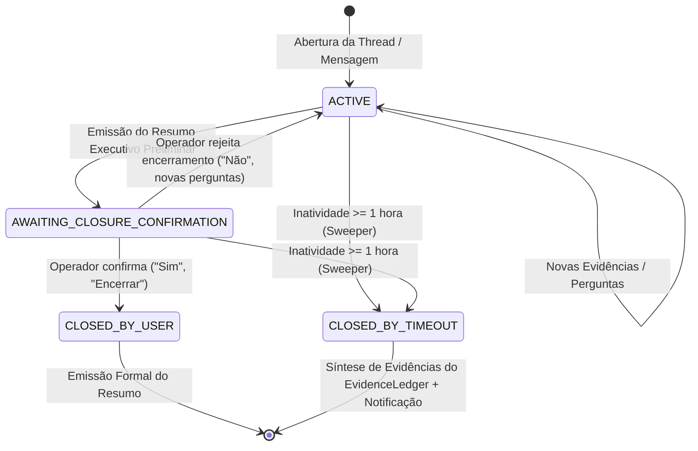

# Arquitetura do Support Agent

O **Support Agent** adota os princípios de **Clean Architecture** e **Arquitetura Hexagonal (Ports & Adapters)** para desacoplar completamente a lógica de negócio do agente (raciocínio, ciclo iterativo, avaliação e memória) dos detalhes de infraestrutura (provedores de LLM, protocolos de comunicação, filas e bancos de dados).

---

## 1. Visão Geral e Diagrama do Sistema

O sistema é centrado no domínio e orquestrado pela **Camada Agent Harness**, com comunicação estrita através de contratos de interface (*Ports*) implementados por adaptadores (*Adapters*).

```text
┌─────────────────────────────────────────────────────────────────────────────┐
│                             Use Cases                                       │
│                     ProcessAgentResponseUseCase                             │
└──────────────────────────────────┬──────────────────────────────────────────┘
                                   │ (Delega execução ao Runtime Harness)
                                   ▼
┌─────────────────────────────────────────────────────────────────────────────┐
│                           Agent Harness Layer                               │
│     InvestigationEngine ──► PlaybookRegistry (Pluggable Playbooks)          │
│                 │                                                           │
│                 ▼                                                           │
│           AgentHarness  ──► ContextAssembler ──► ExecutionPolicy            │
│                 │                │                                          │
│                 │                ▼                                          │
│                 │        TiktokenAdapter (BPE)                              │
└─────────┬───────┴──────────────┬──────────────────┬─────────────────┬───────┘
          │                      │                  │                 │
    ┌─────▼───────┐        ┌─────────▼─────────┐     ┌─────▼─────────┐ ┌─────▼─────────┐
    │ ILLMProvider│        │    IMCPClient     │     │IShortTermMem. │ │IMemoryRepos.  │
    └─────┬───────┘        └─────────┬─────────┘     └─────┬─────────┘ └─────┬─────────┘
          │                          │                     │                 │
    ┌─────▼───────┐        ┌─────────┴─────────┐     ┌─────▼─────────┐ ┌─────▼─────────┐
    │   OpenAI    │        │CompositeMCPClient │     │  Redis STM    │ │ MongoMemory   │
    │   Adapter   │        │(Governance/Router)│     │  (ioredis)    │ │ (Cosine/Vector│
    ├─────────────┤        └─────────┬─────────┘     └───────────────┘ └───────────────┘
    │  Anthropic  │                  │                                        ▲
    │   Adapter   │        ┌─────────┴─────────┐                              │
    ├─────────────┤        ▼                   ▼                              │
    │   DeepSeek  │   ┌─────────┐         ┌─────────┐                         │
    ├─────────────┤   │ K8s MCP │  ...    │Loki MCP │                         │
    │   Google    │   │(Adapter)│         │(Adapter)│                         │
    └─────────────┘   └─────────┘         └─────────┘                         │
          │                                                                   │
          │ (Persiste Run) ┌────────────────────────────────────┐             │
          ▼                │      MemoryPromotionWorker         │     │
    ┌───────────────┐      │   - LLMMemoryExtractor             │     │
    │AgentRunRepos. │      │   - OpenAIEmbeddingProvider (1536d)├─────┘
    │(MongoDB: runs)│      │   - Deduplicação & Idempotência    │
    └───────┬───────┘      └────────────────────────────────────┘
            │
            │ (Enfileira auto-avaliação)
            ▼
    ┌────────────────────────────────────┐
    │       BullMQ Queue Service         │
    │     ('agent-evaluation' queue)     │
    └─────────────────┬──────────────────┘
                      │
                      ▼
    ┌────────────────────────────────────┐
    │        EvaluationWorker            │
    │   - SelfEvaluationPrompt (LLM)     │
    │   - ScoreCalculator (Composite)    │
    │   - Prometheus Metrics Gauges      │
    └─────────────────┬──────────────────┘
                      │
                      ▼
    ┌────────────────────────────────────┐
    │       EvaluationRepository         │
    │    (MongoDB: 'evaluations')        │
    └─────────────────┬──────────────────┘
                      │
                      ▼
    ┌────────────────────────────────────┐
    │        AggregationService          │
    │   - Versões, Comparação & Regressão│
    └─────────────────┬──────────────────┘
                      │
                      ▼
    ┌────────────────────────────────────┐
    │     EvaluationController (API)     │
    │       GET /api/evaluations/*       │
    └────────────────────────────────────┘
```

---

## 2. Camadas da Aplicação

### 2.1. Domain (`src/domain`)
O coração do software. Não possui dependências externas ou de frameworks.
- **Entidades Centrais**:
  - `AgentRun`: Representa a execução ponta a ponta do agente, registrando `runId`, `status`, `durationMs`, iterações, consumo de tokens, custos em USD e histórico de ferramentas invocadas.
  - `Memory`: Fatos e preferências extraídos, categorizados (`fact`, `preference`, `instruction`, `summary`), com peso de importância e vetor de embedding.
  - `Tenant`: Configuração de cliente/espaço, definindo chaves e modelos de LLM e configuração de MCP.
  - `ChatConfig`: Credenciais de provedores de chat (Slack e Google Chat) com segredos criptografados.
  - `User` & `Password`: Gestão de usuários com hashing forte (Argon2id/bcrypt) e associação multi-tenant.
  - `ToolCall` & `Message`: Estruturas puras de conversação e requisições de ferramentas.
- **Módulo de Workflows & Playbooks (`src/domain/workflows`)**:
  - `IInvestigationPlaybook`: Contrato base de um playbook de investigação (identificador, domínio, heurísticas `matches`, prompt especializado e ferramentas recomendadas).
  - `EvidenceLedger`: Agregação estruturada de evidências técnicas coletadas (logs, métricas, traces, eventos de pod e conexões de banco).
  - `SessionSummary`: Value object / entidade que encapsula o Resumo Executivo da investigação, formatando o diagnóstico em Markdown corporativo para canais de chat.
  - `PlaybookRegistry`: Catálogo extensível com busca e seleção de múltiplos playbooks aplicáveis ao contexto.
  - **Playbooks de Domínio (`src/domain/workflows/playbooks/`)**:
    - `ApiErrorPlaybook`: Especialista em erros HTTP 5xx e falhas em APIs (Loki + Prometheus).
    - `LatencyTracePlaybook`: Especialista em tempo de resposta e degradação de performance (Tempo + p95/p99).
    - `KubernetesPlaybook`: Especialista em pods reiniciando, OOMKilled e eventos do cluster.
    - `DatabasePlaybook`: Especialista em esgotamento de pool de conexões, queries lentas e locks.

### 2.2. Ports (`src/domain/ports`)
Contratos de interface que definem tudo o que o domínio necessita do mundo exterior:
- **Execução Agentic**: `IAgentHarness`, `IContextAssembler`, `ITokenCounter`.
- **Inteligência e Ferramentas**: `ILLMProvider`, `IMCPClient`, `IEmbeddingProvider`, `IMemoryExtractor`.
- **Persistência e Filas**: `IMemoryRepository`, `IShortTermMemory`, `IAgentRunRepository`, `IEvaluationRepository`, `IQueueService`.
- **Canais e Segurança**: `IChatProvider`, `IChatConfigRepository`, `IEncryptionService`.

### 2.3. Agent Harness Layer (`src/harness`)
Runtime desacoplado encarregado de executar o ciclo de vida do agente:
- **`AgentHarness`**:
  1. Gera identificador único de execução (`runId`).
  2. Consulta a memória de curto prazo (Redis) e busca memórias relevantes de longo prazo (MongoDB via Cosseno).
  3. Aciona o `ContextAssembler` para empacotar o prompt respeitando o orçamento de tokens.
  4. Executa o loop iterativo com o `ILLMProvider`.
  5. Se o LLM requisitar chamada de ferramenta (`tool_call`), despacha para o `IMCPClient` e injeta a resposta de volta no contexto.
  6. Finaliza a execução, persiste o `AgentRun` no MongoDB e agenda os jobs assíncronos de promoção de memória e auto-avaliação no BullMQ.
- **`ContextAssembler`**: Injeta `systemInstructions`, memórias semânticas e trunca o histórico mais antigo quando necessário.
- **`ExecutionPolicy`**: Guardrail que limita o loop a no máximo 5 iterações e impõe timeouts defensivos.
- **`InvestigationEngine`**:
  - Avalia a mensagem inicial do usuário e o histórico de contexto.
  - Consulta o `PlaybookRegistry` e seleciona os playbooks adequados (retorna `null` em modo conversacional comum).
  - Injeta o protocolo universal SRE (*Triagem ➔ Hipótese ➔ Coleta de Evidências ➔ Correlação Cruzada ➔ Causa Raiz / RCA ➔ Session Summary*).
  - Extrai e valida o `SessionSummary` estruturado na finalização do atendimento.

### 2.4. Use Cases (`src/usecases`)
Orquestram os fluxos de aplicação sem acoplar a regras específicas de canais:
- `ProcessAgentResponseUseCase`: Ponto de entrada chamado por webhooks ou workers para carregar contexto e invocar o Harness.
- `RegisterTenantUseCase`, `RegisterUserUseCase`, `LoginUserUseCase`, `RegisterChatConfigUseCase`.

### 2.5. Infrastructure (`src/infrastructure`)
Adaptadores concretos das interfaces de domínio:
- **LLM**: `OpenAIAdapter`, `AnthropicAdapter`, `GoogleAdapter`, `DeepSeekAdapter`, unificados via `LLMFactory`.
- **MCP & Multi-MCP**: `MCPHttpAdapter` (JSON-RPC 2.0 direto) e `CompositeMCPClient` (agregação de múltiplos servidores MCP com namespacing determinístico `<serverId>__<toolName>`, roteamento inteligente com prefix stripping reverso, circuit breakers isolados e tolerância a falhas parciais).
- **Tool Governance**: `ToolGovernanceService` para classificação semântica preventiva de risco (`READ_ONLY`, `LOW_RISK`, `HIGH_RISK`, `FORBIDDEN`) e bloqueio preventivo de comandos destrutivos.
- **Embeddings**: `OpenAIEmbeddingProvider` (vetorização com `text-embedding-3-small`, 1536 dimensões).
- **Memória & Filas**: `RedisShortTermMemory` (ioredis), `BullMQAdapter` e workers (`BullMQWorker`, `MemoryPromotionWorker`, `EvaluationWorker`).
- **Segurança**: `AESEncryptionService` (AES-256-GCM para segredos em repouso e chaves MCP).

### 2.6. Repositories (`src/repositories`)
Implementações de acesso a dados em MongoDB nativo:
- `MongoMemoryRepository`: Armazena memórias e executa cálculo de similaridade de cosseno em memória ou queries semânticas.
- `AgentRunRepository`: Armazena execuções completas de agentes com paginação, filtros e agregadores analíticos.
- `EvaluationRepository`: Persiste resultados de auto-avaliação do agente.
- `ChatConfigRepository`, `TenantRepository`, `UserRepository`, `ChatRepository`.

---

## 3. Subsistema de Memória 2.0 (Recuperação Híbrida & Ciclo de Vida)

O Support Agent adota uma arquitetura de memória corporativa de alta fidelidade e governança contínua:

```text
┌────────────────────────────────────────────────────────────────────────────────────────┐
│                                   DIÁLOGO ATIVO                                        │
└───────────────────────────┬────────────────────────────────┬───────────────────────────┘
                            │                                │
            (Contexto imediato da thread)        (Fatos duradouros / Resoluções / Incidentes)
                            │                                │
                            ▼                                ▼
               ┌────────────────────────┐       ┌────────────────────────┐
               │   Short-Term Memory    │       │    Long-Term Memory    │
               │         (Redis)        │       │   (MongoDB 2.0 Híbrido)│
               └────────────────────────┘       └────────────┬───────────┘
                                                             │
                         ┌───────────────────────────────────┴───────────────────────────────────┐
                         ▼                                                                       ▼
             ┌────────────────────────┐                                              ┌────────────────────────┐
             │  Recuperação Híbrida   │                                              │   Ciclo de Vida (TTL)  │
             │  • Vetorial (Cosseno)  │                                              │  • candidate (conf<0.8)│
             │  • Textual ($text)     │                                              │  • validated           │
             │  • RRF (k=60)          │                                              │  • active (conf>=0.8)  │
             │  • Contextual Reranker │                                              │  • updated             │
             └────────────────────────┘                                              │  • expired (TTL Mongo) │
                                                                                     └────────────────────────┘
```

### 3.1. Níveis de Memória
1. **Short-Term Memory (Redis)**:
   - Chave: `memory:short:{workspaceId}:{threadId}`.
   - Armazena as interações mais recentes da thread atual para manter a continuidade imediata.
   - TTL configurável por workspace/tenant.
2. **Long-Term Memory (MongoDB + Embeddings + Text Index)**:
   - Armazena o conhecimento permanente isolado rigorosamente por `tenantId` e `workspaceId`.
   - Índices nativos criados em `ensureIndexes()`:
     - Text Index composto: `{ content: 'text', tags: 'text' }` com pesos `{ tags: 5, content: 1 }`.
     - TTL Index nativo: `{ expiresAt: 1 }` com `expireAfterSeconds: 0`.
     - Índice composto multi-tenant: `{ tenantId: 1, workspaceId: 1, status: 1, createdAt: -1 }`.

### 3.2. Motor de Recuperação Híbrida & Algoritmo RRF (Reciprocal Rank Fusion)
A recuperação vetorial por similaridade de cosseno é excelente para proximidade semântica genérica, mas insuficiente em incidentes de infraestrutura que exigem correspondência exata de termos operacionais (códigos de erro como `ERR_DATABASE_POOL_EXHAUSTED`, códigos HTTP `504`, IDs de transação ou slugs de pods/serviços).

O método `searchHybrid` combina as duas técnicas via **Reciprocal Rank Fusion (RRF)**:
$$RRF(d) = \left( \frac{w_{\text{vec}}}{k + r_{\text{vec}}(d)} + \frac{w_{\text{text}}}{k + r_{\text{text}}(d)} \right) \cdot (1 + \text{importance} \cdot 0.2)$$

- **Constante $k=60$**: Suaviza a discrepância entre posições de ranking.
- **Pesos padrão**: $w_{\text{text}} = 1.2$ (prioriza termos técnicos exatos) e $w_{\text{vec}} = 1.0$.
- **Ponderação por Importância**: Memórias com peso operacional maior recebem um multiplicador de até 20%.

### 3.3. Contextual Memory Reranker (`ContextualMemoryReranker`)
Após a fusão RRF, o `ContextualMemoryReranker` refina os top-K candidatos aplicando:
1. **Extração de Termos Técnicos**: Regex para códigos HTTP (`100-599`), constantes de erro (`ERR_*`, `*_ERROR`), nomes de exceções (`*Exception`, `*Error`) e slugs de microsserviços.
2. **Bônus de Correspondência Exata**: Aumenta o score quando os termos operacionais da mensagem aparecem no conteúdo ou nas tags da memória.
3. **Decaimento Exponencial por Recência**:
   $$\text{Score}_{\text{final}} = \text{Score} \cdot e^{-\lambda \cdot \Delta t}$$
   Com fator $\lambda = 0.02$, correspondendo a uma meia-vida operacional de aproximadamente 35 dias para incidentes transitórios.

### 3.4. Máquina de Estados e Ciclo de Vida da Memória
O domínio (`MemoryLifecycle`) implementa uma máquina de estados estrita:

```text
    ┌──────────────┐
    │  candidate   │ ──(curadoria/validação)──► ┌─────────────┐
    └──────┬───────┘                            │  validated  │
           │                                    └──────┬──────┘
           │ (auto-ativação conf >= 0.8)               │
           └───────────────────┬───────────────────────┘
                               ▼
                        ┌─────────────┐
        ┌────────────── │   active    │ ◄─────────────┐
        │               └──────┬──────┘               │
        │ (edição)             │ (expiração TTL)      │ (re-ativação)
        ▼                      ▼                      │
  ┌───────────┐         ┌─────────────┐               │
  │  updated  │────────►│   expired   │───────────────┘
  └───────────┘         └─────────────┘
```

- **Classificação Inicial Automática**:
  - `LLMMemoryExtractor` atribui `confidenceScore` (0 a 1.0).
  - Se $\text{score} \ge 0.8$: status `active`.
  - Se $\text{score} < 0.8$: status `candidate` (aguarda curadoria humana).
- **TTL por Categoria**:
  - `incident`: TTL de 30 dias (fatos temporários de degradação).
  - `resolution`: TTL de 90 dias.
  - `fact` / `preference`: permanente (`expiresAt = null`).
- **Expiração & Purga**:
  - MongoDB TTL Index remove automaticamente documentos quando `expiresAt <= now`.
  - Repositório expõe `findExpired()` e `purgeExpired()` para limpeza programada e auditoria.

### 3.5. API REST de Governança (`/api/memories`)
Interface administrativa segura protegida por JWT, rate limiting e RBAC:
- `GET /api/memories`: Consulta paginada com filtros por tenant, workspace, status, tipo e tag (`viewer`, `operator`, `admin`).
- `POST /api/memories/search`: Execução operacional de busca híbrida com inspeção de scores vetoriais e textuais (`viewer`, `operator`, `admin`).
- `GET /api/memories/candidates`: Fila de memórias pendentes de curadoria humana (`operator`, `admin`).
- `PATCH /api/memories/:id/status`: Transição manual de status com validação de máquina de estados (`operator`, `admin`).
- `PUT /api/memories/:id`: Edição de conteúdo, importância e tags (`operator`, `admin`).
- `DELETE /api/memories/:id`: Exclusão definitiva de memória obsoleta (`admin`).

---

## 4. Subsistema Multi-MCP Platform & Governança de Ferramentas

O Support Agent evoluiu sua integração MCP de uma conexão ponto-a-ponto isolada para uma **Plataforma Multi-MCP Composta**, permitindo conectar simultaneamente múltiplos servidores especializados (Kubernetes, Observabilidade, Banco de Dados, etc.) sob o mesmo tenant de forma isolada, governada e com alto desempenho.

```text
┌────────────────────────────────────────────────────────────────────────────────────────┐
│                              ProcessAgentResponseUseCase                               │
│                         (Avalia Playbooks & Seleciona Domínios)                         │
└───────────────────────────────────────────┬────────────────────────────────────────────┘
                                            │
                                            ▼
┌────────────────────────────────────────────────────────────────────────────────────────┐
│                                  CompositeMCPClient                                    │
│  ┌──────────────────────────────────────────────────────────────────────────────────┐  │
│  │ 1. Tool Discovery Contextual: filtra por domínios ('kubernetes', 'observability')│  │
│  │ 2. Namespacing Determinístico: expõe `<serverId>__<toolName>` ao LLM              │  │
│  │ 3. Tool Governance Service: avalia risco da tool antes da chamada               │  │
│  │    • READ_ONLY    ➔ Execução liberada                                            │  │
│  │    • FORBIDDEN    ➔ Bloqueio imediato preventivo sem crash                       │  │
│  │    • HIGH_RISK    ➔ Exige confirmação / aprovação manual                         │  │
│  │ 4. Roteamento Reverso & Prefix Stripping: envia `toolName` limpo ao servidor alvo │  │
│  └────────────────────────────────────────┬─────────────────────────────────────────┘  │
└───────────────────────────────────────────┼────────────────────────────────────────────┘
                                            │
                  ┌─────────────────────────┼─────────────────────────┐
                  ▼                         ▼                         ▼
        ┌───────────────────┐     ┌───────────────────┐     ┌───────────────────┐
        │  MCPHttpAdapter   │     │  MCPHttpAdapter   │     │  MCPHttpAdapter   │
        │  (k8s-cluster)    │     │  (observability)  │     │  (database-sql)   │
        ├───────────────────┤     ├───────────────────┤     ├───────────────────┤
        │ • Circuit Breaker │     │ • Circuit Breaker │     │ • Circuit Breaker │
        │   Isolado (k8s)   │     │   Isolado (obs)   │     │   Isolado (db)    │
        │ • Timeout próprio │     │ • Timeout próprio │     │ • Timeout próprio │
        │ • AES-256-GCM Key │     │ • AES-256-GCM Key │     │ • AES-256-GCM Key │
        └───────────────────┘     └───────────────────┘     └───────────────────┘
```

### 4.1. Namespacing e Roteamento Reverso
- **Evita Colisões**: Quando dois servidores exportam ferramentas com o mesmo nome (ex: `query` ou `get_status`), o `CompositeMCPClient` prefixa automaticamente as ferramentas como `<serverId>__<toolName>` (ex: `k8s__get_status` e `obs__get_status`).
- **Prefix Stripping**: Durante a execução, o cliente intercepta o ToolCall, identifica o servidor correspondente pelo prefixo, extrai o nome original da ferramenta e envia apenas o nome original para o servidor MCP remoto.

### 4.2. Isolamento de Falhas e Circuit Breakers Independentes
- **Tolerância a Falhas Parciais**: Conexões com múltiplos servidores são inicializadas em paralelo com `Promise.allSettled`. Se um dos servidores estiver indisponível ou instável, os demais continuam operando normalmente.
- **Circuit Breakers Isolados**: Cada servidor MCP possui seu próprio `CircuitBreaker` instanciado com o identificador `${tenantId}-${serverId}`. Se o servidor de observabilidade falhar repetidamente e abrir o circuito, o servidor de Kubernetes permanece 100% disponível.

### 4.3. Tool Governance & Matriz de Risco
O `ToolGovernanceService` intercepta chamadas de ferramentas prevenindo ações acidentais ou abusivas de agentes autônomos:
- **`READ_ONLY`**: Ferramentas de inspeção e telemetria (`get_*`, `list_*`, `query_*`, `describe_*`, `fetch_*`, `read_*`). Executadas com autonomia total.
- **`LOW_RISK`**: Ações operacionais informativas ou de baixo impacto (`ping_*`, `test_*`, `validate_*`, `check_*`).
- **`HIGH_RISK`**: Modificações de estado operacional (`restart_*`, `scale_*`, `deploy_*`, `rollback_*`). Exigem aprovação ou confirmação explícita (`requiresApproval: true`).
- **`FORBIDDEN`**: Ações destrutivas com risco de perda de dados irreversível (`delete_*`, `drop_*`, `truncate_*`, `kill_*`, `purge_*`). Bloqueadas preventivamente no cliente composto, retornando recusa estruturada para o agente sem abortar a conversa.
- **Políticas e Overrides por Tenant**: Suporte a expressões com wildcards glob (`*`) customizáveis por tenant via `ToolGovernancePolicy`.

### 4.4. Descoberta Contextual de Ferramentas (Contextual Discovery)
- Em vez de inundar a janela de contexto do LLM com dezenas de ferramentas de todos os servidores cadastrados, o `InvestigationEngine` analisa a mensagem do usuário e contexto da sessão para identificar os playbooks pertinentes (`kubernetes`, `api_error`, `latency_trace`, `database`).
- Os playbooks mapeiam seus domínios investigativos (`kubernetes`, `observability`, `database`), passando `ToolFilterOptions` ao `CompositeMCPClient.listTools({ domains })`.
- Somente ferramentas dos servidores pertencentes aos domínios ativos (além dos servidores default) são injetadas no prompt do LLM, economizando tokens e eliminando alucinações de escolha de ferramenta.

---

## 5. Pipeline de Telemetria e Avaliação Contínua

```text
[AgentHarness Finalizado]
         │
         ├─► Salva AgentRun no MongoDB (tokens, custo USD, tools, latência)
         │
         └─► Publica job na fila 'agent-evaluation' (BullMQ)
                  │
                  ▼
         [EvaluationWorker]
                  │
                  ├─► Prompt LLM 'Judge' (avalia resposta contra input e contexto)
                  ├─► ScoreCalculator:
                  │     • Answer Correctness (40%)
                  │     • Tool Selection Accuracy (25%)
                  │     • Context Relevance (15%)
                  │     • Hallucination Freedom (10%)
                  │     • Memory Usefulness (10%)
                  │
                  ├─► Atualiza Gauges no Prometheus (agent_evaluation_score)
                  └─► Salva Evaluation no MongoDB
```

- **Agregação e Detecção de Regressões**:
  - `AggregationService` calcula médias móveis por versão do agente (`promptVersion` ou release de código).
  - Comparações automatizadas detectam se uma nova versão introduziu queda de pontuação ou aumento anormal de alucinações.

---

## 6. Resiliência e Confiabilidade

1. **Circuit Breakers Isolados para MCP**:
   - Cada servidor MCP registrado mantém seu próprio estado de `CircuitBreaker`.
   - Falhas consecutivas em um servidor (ex: Loki) não afetam a disponibilidade dos outros (ex: Kubernetes).
2. **Idempotência**:
   - Webhooks de mensageria (Slack / Google Chat) utilizam chaves de idempotência baseadas em `eventId` ou hash da mensagem no Redis para prevenir respostas duplicadas.
3. **Limites de Execução (Guardrails)**:
   - `ExecutionPolicy` limita qualquer corrida agentic a 5 iterações de ferramentas.
   - Timeouts estritos por iteração e por chamada de LLM.
4. **Graceful Shutdown**:
   - Tratamento de `SIGTERM` e `SIGINT` aguardando a finalização de jobs em execução no BullMQ e fechando pools de conexões de forma segura.

---

## 7. Observabilidade Nativa

O sistema possui observabilidade completa integrada aos três pilares:

| Pilar | Tecnologia | Detalhes |
|---|---|---|
| **Logs** | Pino + Grafana Loki | Formato JSON estruturado com correlação via `trace_id`, `span_id`, `tenantId` e `runId`. |
| **Métricas** | Prometheus | Expostas em `/metrics`. Coletam latência do loop agentic, contadores de tokens, chamadas MCP e gauges de avaliação. |
| **Tracing** | OpenTelemetry + Tempo | Spans granulares por requisição HTTP, iteração do Harness, chamadas de LLM, embeddings e operações de repositório. |

Consulte [grafana-tempo-tracing.md](grafana-tempo-tracing.md) para detalhes da topologia de rastreamento.

---

## 8. Ciclo de Vida Híbrido de Sessão de Investigação (Session Lifecycle)

Para suportar investigações de incidentes de TI com início, meio e encerramento auditável, o agente implementa o modelo de **Ciclo de Vida Híbrido** gerenciado por `InvestigationSession`, `ClosureIntentDetector` e `SessionTimeoutSweeper`:

```text
                             [Nova Mensagem do Usuário]
                                         │
                                         ▼
                            ┌────────────────────────┐
                            │ ProcessAgentResponse   │
                            └───────────┬────────────┘
                                        │
                      Existe sessão ativa para a thread?
                                ├── Não ──► Cria InvestigationSession (ACTIVE)
                                └── Sim
                                     │
                      Está em AWAITING_CONFIRMATION?
                         ├── Sim: Checa ClosureIntentDetector
                         │     ├── 'CONFIRM_CLOSURE' ──► Fecha CLOSED_BY_USER + Emite Summary (0 tokens LLM)
                         │     └── 'REJECT_CLOSURE'  ──► Reverte para ACTIVE + Continua Investigação
                         └── Não: Checa Comando /encerrar
                               ├── Sim ──► Fecha CLOSED_BY_USER + Emite Summary
                               └── Não ──► session.touch() + Executa AgentHarness
                                                 │
                                 Harness emitiu SessionSummary?
                                       ├── Sim ──► session.proposeClosure() -> AWAITING_CONFIRMATION
                                       └── Não ──► Mantém ACTIVE
                                                 │
                                                 ▼
                                        [Salva no MongoDB]
```

### 8.1. Máquina de Estados



### 8.2. Modelo de Dados (`investigation_sessions`)

A coleção `investigation_sessions` no MongoDB armazena o histórico auditável de cada incidente:

```json
{
  "id": "sess-uuid-v4",
  "workspaceId": "ws-production",
  "threadId": "1710000000.123456",
  "channelId": "C0123456789",
  "status": "CLOSED_BY_USER",
  "startedAt": "2026-09-18T10:00:00.000Z",
  "lastInteractionAt": "2026-09-18T10:45:00.000Z",
  "closedAt": "2026-09-18T10:46:00.000Z",
  "idleTimeoutMs": 3600000,
  "evidenceLedger": {
    "logs": [...],
    "metrics": [...],
    "traces": [...],
    "infrastructure": [...],
    "database": [...]
  },
  "sessionSummary": {
    "runId": "run-uuid",
    "serviceName": "payment-api",
    "rootCauseHypothesis": "Pool de conexões exaurido",
    "recommendedActions": [...]
  },
  "metadata": { "source": "slack" },
  "updatedAt": "2026-09-18T10:46:00.000Z"
}
```

Índices configurados:
- `{ id: 1 }` (único)
- `{ workspaceId: 1, threadId: 1, status: 1 }` (recuperação da sessão ativa)
- `{ status: 1, lastInteractionAt: 1 }` (varredura rápida de inatividade para o `SessionTimeoutSweeper`)

