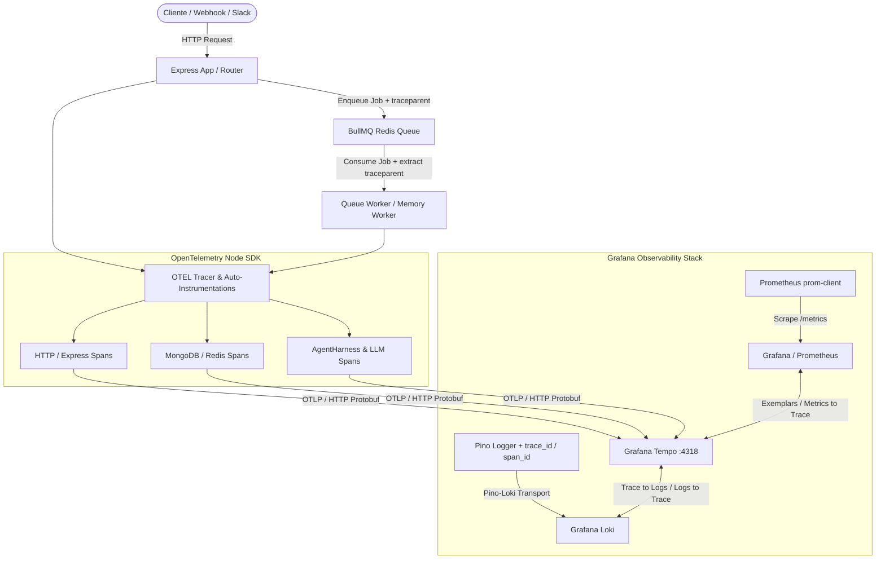

# Plano de Implementação: Tracing Distribuído com OpenTelemetry e Grafana Tempo

> **Projeto:** Support Agent  
> **Slug:** `grafana-tempo-tracing`  
> **Tipo de Projeto:** BACKEND  
> **Status:** Planejamento Aprovado (Aguardando Execução)  

---

## 1. Visão Geral

Implementar a camada completa de rastreamento distribuído (Distributed Tracing) no `support-agent` utilizando o **OpenTelemetry SDK** e exportação **OTLP/HTTP** para o **Grafana Tempo**, com correlação bidirecional entre Traces (Tempo), Logs (Loki) e Métricas (Prometheus).

### Critérios de Sucesso
- [x] Traces de requisições HTTP da API Express exportados automaticamente para o Grafana Tempo.
- [x] Spans detalhados de infraestrutura (MongoDB, IORedis, chamadas HTTP de saída) capturados com latência e status.
- [x] Spans semânticos manuais no `AgentHarness` para monitorar execução de LLMs, busca de contexto e execução de ferramentas (MCP/Tools).
- [x] Injeção automática de `trace_id` e `span_id` em todos os logs gerados pelo Pino (correlação automática no Grafana com o Loki).
- [x] Propagação de contexto (`traceparent`) através da fila assíncrona BullMQ (API HTTP ➔ Worker Job).
- [x] Inicialização limpa e resiliente: se o endpoint do Tempo estiver indisponível ou não configurado, a aplicação não deve falhar nem degradar performance.

---

## 2. Arquitetura e Decisões Técnicas



### Tecnologias e Dependências
- `@opentelemetry/sdk-node`: Inicialização central do SDK do Node.js.
- `@opentelemetry/api`: API para criação de spans customizados e obtenção do contexto ativo.
- `@opentelemetry/auto-instrumentations-node`: Auto-instrumentação para HTTP, Express, MongoDB, IORedis, etc.
- `@opentelemetry/exporter-trace-otlp-http`: Exportador OTLP via HTTP/protobuf para envio ao Tempo.

---

## 3. Estrutura de Arquivos Planejada

```
src/
├── config/
│   ├── tracing.ts              # [NOVO] Inicialização do OpenTelemetry SDK e OTLP Exporter
│   ├── logger.ts               # [MODIFICAR] Inclusão de mixin do Pino para injetar trace_id e span_id
│   └── container.ts            # [MODIFICAR] Injeção de dependências e helpers de tracer se necessário
├── infrastructure/
│   ├── tracing/
│   │   ├── TracerProvider.ts   # [NOVO] Wrapper/Helper tipado para criação de spans semânticos
│   │   └── TraceContext.ts     # [NOVO] Utilitários para propagação W3C (traceparent) em filas e jobs
│   └── queue/
│       ├── BullMQService.ts    # [MODIFICAR] Propagação de contexto W3C no enqueue
│       └── QueueWorker.ts      # [MODIFICAR] Extração e continuidade do trace no processamento do job
├── harness/
│   └── AgentHarness.ts         # [MODIFICAR] Spans customizados para ciclo de execução do agente e LLM
├── index.ts                    # [MODIFICAR] Garantir carregamento do tracing antes do bootstrap
└── package.json                # [MODIFICAR] Adição das dependências OpenTelemetry e script de start
```

---

## 4. Lista Detalhada de Tarefas (Task Breakdown)

### 📦 Fase 1: Fundação & Dependências OpenTelemetry
- [x] **TASK-01**: Instalar pacotes do ecossistema OpenTelemetry (`@opentelemetry/sdk-node`, `@opentelemetry/api`, `@opentelemetry/auto-instrumentations-node`, `@opentelemetry/exporter-trace-otlp-http`).
  - **Agente:** `backend-specialist` | **Skill:** `@clean-code`
  - **INPUT:** `package.json`
  - **OUTPUT:** Dependências instaladas e `package.json` atualizado.
  - **VERIFY:** `npm ls @opentelemetry/sdk-node` sem conflitos de versão.

- [x] **TASK-02**: Criar módulo de configuração do tracing (`src/config/tracing.ts`).
  - **Agente:** `devops-engineer` | **Skill:** `@clean-code`
  - **INPUT:** Variáveis de ambiente (`OTEL_EXPORTER_OTLP_ENDPOINT`, `OTEL_EXPORTER_OTLP_HEADERS`, `OTEL_SERVICE_NAME`, `OTEL_TRACES_SAMPLER`).
  - **OUTPUT:** `src/config/tracing.ts` com inicialização resiliente do `NodeSDK` e desligamento gracioso (`sdk.shutdown()`).
  - **VERIFY:** Arquivo compila em TypeScript sem erros.

- [x] **TASK-03**: Ajustar o ponto de entrada da aplicação (`src/index.ts` e scripts do `package.json`).
  - **Agente:** `backend-specialist` | **Skill:** `@clean-code`
  - **INPUT:** `src/index.ts` e `package.json`
  - **OUTPUT:** Importação antecipada do `tracing.ts` e integração do `sdk.shutdown()` no handler de graceful shutdown.
  - **VERIFY:** `npm run dev` e `npm run build` executam normalmente.

---

### 🪵 Fase 2: Correlação Trace-to-Logs (Pino ⇄ Loki ⇄ Tempo)
- [x] **TASK-04**: Integrar OpenTelemetry Context com o Pino Logger (`src/config/logger.ts`).
  - **Agente:** `devops-engineer` | **Skill:** `@clean-code`
  - **INPUT:** `src/config/logger.ts` e `@opentelemetry/api`
  - **OUTPUT:** Mixin no Pino que recupera o span ativo via `trace.getSpan(context.active())` e anexa `trace_id`, `span_id` e `trace_flags` em cada log emitido.
  - **VERIFY:** Logs gerados durante uma requisição HTTP exibem `trace_id` e `span_id`.

---

### 🧵 Fase 3: Propagação de Contexto Assíncrono (BullMQ)
- [x] **TASK-05**: Implementar helper de propagação W3C TraceContext (`src/infrastructure/tracing/TraceContext.ts`).
  - **Agente:** `backend-specialist` | **Skill:** `@clean-code`
  - **INPUT:** `@opentelemetry/api` (propagation API: `propagation.inject` e `propagation.extract`).
  - **OUTPUT:** Utilitários para injetar headers `traceparent` no payload do BullMQ e reidratar o span de contexto no Worker.
  - **VERIFY:** Testes unitários para injeção e extração de contexto.

- [x] **TASK-06**: Atualizar produtor e consumidor da fila BullMQ.
  - **Agente:** `backend-specialist` | **Skill:** `@clean-code`
  - **INPUT:** `src/infrastructure/queue/` e workers.
  - **OUTPUT:** Jobs criados carregam o traceparent e workers executam seus jobs encapsulados em um span filho vinculado.
  - **VERIFY:** Trace gerado no envio do job e no processamento do worker compartilham o mesmo `trace_id`.

---

### 🤖 Fase 4: Spans Semânticos no Agent Harness & LLMs
- [x] **TASK-07**: Criar helper de instrumentação de IA/Harness (`src/infrastructure/tracing/TracerProvider.ts`).
  - **Agente:** `backend-specialist` | **Skill:** `@clean-code`
  - **INPUT:** `src/infrastructure/tracing/`
  - **OUTPUT:** Métodos utilitários como `withSpan(name, attributes, fn)` para instrumentar blocos assíncronos com captura de erro e status sem poluir o código de domínio.
  - **VERIFY:** Testes unitários do wrapper de spans.

- [x] **TASK-08**: Instrumentar o ciclo de execução do `AgentHarness` (`src/harness/AgentHarness.ts`).
  - **Agente:** `backend-specialist` | **Skill:** `@clean-code`
  - **INPUT:** `src/harness/AgentHarness.ts`
  - **OUTPUT:** Spans customizados para:
    - `agent.execute` (span raiz da execução do agente)
    - `agent.context_assembly` (tempo de recuperação de memória)
    - `agent.llm_call` (tempo, modelo utilizado e contagem de tokens)
    - `agent.tool_execution` (tempo e parâmetros da ferramenta)
  - **VERIFY:** Spans aparecem no trace com metadados semânticos apropriados.

---

### ⚙️ Fase 5: Documentação e Variáveis de Ambiente
- [x] **TASK-09**: Atualizar `.env.example` e documentação de observabilidade.
  - **Agente:** `documentation-writer` | **Skill:** `@clean-code`
  - **INPUT:** `.env.example` e `README.md` / `docs/`
  - **OUTPUT:** Variáveis `OTEL_EXPORTER_OTLP_ENDPOINT`, `OTEL_SERVICE_NAME`, `OTEL_EXPORTER_OTLP_HEADERS` documentadas com guia de configuração para Grafana Cloud e Tempo Local.
  - **VERIFY:** Documentação clara e referenciada.

---

## 5. Plano de Rollback e Riscos

| Risco | Impacto | Mitigação |
|---|---|---|
| Tempo indisponível ou falha de rede | Possível lentidão ou timeout na aplicação | OTLP Exporter é não-bloqueante e usa buffer assíncrono em lote (`BatchSpanProcessor`). Se não configurado, o SDK opera em modo no-op. |
| Overhead de CPU/Memória por alto volume de spans | Aumento no consumo de recursos | Configurar amostragem (`TraceIdRatioBasedSampler` ou `ParentBasedSampler`) via variável `OTEL_TRACES_SAMPLER_ARG`. |
| Conflitos no ESM do Node.js | Erros no boot com `tsx` ou `node` | Carregamento desacoplado em `tracing.ts` antes de instanciar os controladores e routers do Express. |

---

## 6. Verificação Final (Phase X)

## ✅ PHASE X COMPLETE
- Lint & Type Check: ✅ Pass (`npx tsc --noEmit` e `npm run build`)
- Unit & Integration Tests: ✅ 134/134 testes aprovados em 27 suítes (`npm test`)
- Build: ✅ TypeScript compilado para `dist/` com sucesso
- Date: 2026-08-24

