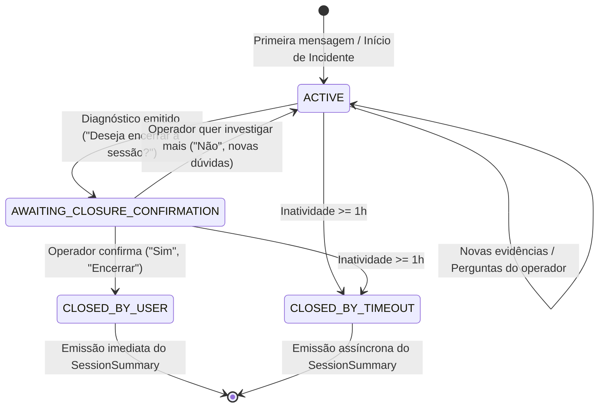

# Plano de Implementação — Ciclo de Vida Híbrido de Sessão (Opção C)

> **Slug:** `session-lifecycle`  
> **Fase:** Fase 7 — Ciclo de Vida Híbrido de Sessão de Investigação  
> **Status:** 📝 Proposto (Aguardando Aprovação)  
> **Agente Líder:** `project-planner`  
> **Especialistas:** `backend-specialist`, `database-architect`, `qa-automation-engineer`

---

## 1. Visão Geral e Contexto

Durante uma investigação de incidentes de TI/SRE, um agente de suporte interage através de mensagens no Slack ou Google Chat, coletando evidências técnicas (logs, métricas, traces) registradas no [EvidenceLedger](src/domain/workflows/EvidenceLedger.ts) e consolidando conclusões no [SessionSummary](src/domain/workflows/SessionSummary.ts).

Atualmente, o histórico de mensagens é mantido de forma contínua por `threadId` sem uma noção formal de **ciclo de vida de sessão**, o que dificulta:
1. Saber quando um incidente foi resolvido para disparar o fechamento formal.
2. Evitar sessões "zumbis" ou órfãs quando o operador abandona o chat após resolver a emergência.
3. Emitir automaticamente o relatório consolidado de auditoria ([SessionSummary](src/domain/workflows/SessionSummary.ts)) no momento exato da conclusão.

### A Solução: Opção C (Ciclo de Vida Híbrido)

A Opção C implementa uma máquina de estados com dois mecanismos complementares de encerramento:
1. **Gatilho Conversacional Explícito (User-Driven):** Ao concluir a hipótese de causa raiz e propor mitigação, o bot sugere ativamente o encerramento da sessão ou aceita comandos diretos (ex: `/encerrar`, "pode encerrar", "incidente resolvido"). O usuário confirma e recebe imediatamente o `SessionSummary`.
2. **Gatilho de Salvaguarda por Inatividade (Idle Timeout):** Caso a sessão fique sem novas interações por um intervalo configurável (default: 1 hora de inatividade), um processo em segundo plano (sweeper/worker) encerra a sessão com status `CLOSED_BY_TIMEOUT` e emite o `SessionSummary` gerado a partir do `EvidenceLedger`.

---

## 2. Arquitetura e Componentes

### 2.1 Entidade de Domínio: `InvestigationSession`
- Local: `src/domain/InvestigationSession.ts`
- **Atributos:**
  - `id`: string (UUID)
  - `workspaceId`: string
  - `threadId`: string
  - `channelId`: string
  - `status`: `SessionStatus` (`ACTIVE` | `AWAITING_CLOSURE_CONFIRMATION` | `CLOSED_BY_USER` | `CLOSED_BY_TIMEOUT`)
  - `startedAt`: Date
  - `lastInteractionAt`: Date
  - `closedAt?:` Date
  - `idleTimeoutMs`: number (default: 3.600.000 ms = 1 hora)
  - `evidenceLedger`: `EvidenceLedger`
  - `sessionSummary?:` `SessionSummary`
  - `metadata?:` Record<string, any>
- **Regras de Negócio e Métodos:**
  - `touch()`: Atualiza `lastInteractionAt = new Date()`.
  - `proposeClosure()`: Transita `ACTIVE -> AWAITING_CLOSURE_CONFIRMATION`.
  - `confirmClosure(summary?: SessionSummary)`: Valida e transita para `CLOSED_BY_USER`.
  - `expireByTimeout(summary?: SessionSummary)`: Valida inatividade e transita para `CLOSED_BY_TIMEOUT`.
  - `isExpired(now?: Date)`: Retorna booleano `(now - lastInteractionAt) >= idleTimeoutMs`.

### 2.2 Repositório: `ISessionRepository` & `MongoSessionRepository`
- Local: `src/domain/ports/ISessionRepository.ts` e `src/repositories/MongoSessionRepository.ts`
- **Métodos:**
  - `save(session: InvestigationSession): Promise<void>`
  - `findById(id: string): Promise<InvestigationSession | null>`
  - `findActiveByThreadId(threadId: string, workspaceId: string): Promise<InvestigationSession | null>`
  - `findInactiveSessions(cutoffDate: Date, limit?: number): Promise<InvestigationSession[]>`
- **Índices MongoDB:**
  - `{ workspaceId: 1, threadId: 1, status: 1 }`
  - `{ status: 1, lastInteractionAt: 1 }` (otimizado para busca rápida do sweeper)

### 2.3 Detector Conversacional de Intenção de Encerramento
- Local: `src/services/ClosureIntentDetector.ts`
- **Responsabilidade:**
  - Analisar a mensagem do usuário quando a sessão está em `AWAITING_CLOSURE_CONFIRMATION` ou quando o usuário envia comando explícito (`/encerrar`, `fechar sessão`, `resolvido`).
  - Classificar intenção: `CONFIRM_CLOSURE`, `REJECT_CLOSURE` (deseja continuar), ou `REGULAR_MESSAGE`.

### 2.4 Sweeper de Inatividade & Background Job
- Local: `src/services/SessionTimeoutSweeper.ts` e `src/infrastructure/queue/SessionTimeoutWorker.ts`
- **Responsabilidade:**
  - Execução periódica (ex: a cada 5 minutos via BullMQ Repeatable Job ou setInterval seguro).
  - Localizar sessões cujo `lastInteractionAt` ultrapassou o `idleTimeoutMs`.
  - Extrair ou compilar o `SessionSummary` a partir das evidências registradas.
  - Atualizar status para `CLOSED_BY_TIMEOUT`.
  - Enviar notificação de encerramento automático com o resumo na thread via `IChatProvider`.

### 2.5 Integração no Fluxo Principal (`ProcessAgentResponseUseCase`)
- Se existir sessão ativa para a `threadId`:
  - Se estiver em `AWAITING_CLOSURE_CONFIRMATION`, avalia se a resposta confirma o encerramento.
  - Se confirmar: encerra a sessão como `CLOSED_BY_USER`, persiste e despacha o `SessionSummary`.
  - Se não confirmar: retorna para `ACTIVE`, atualiza `lastInteractionAt` e segue o fluxo de investigação normal.
- Se não existir sessão ativa (ou a anterior estiver fechada) e o usuário enviar uma nova mensagem:
  - Cria uma nova instância de `InvestigationSession` vinculada à thread.

---

## 3. Divisão de Sub-Fases de Implementação

| Sub-Fase | Escopo | Responsável |
| :--- | :--- | :--- |
| **7A (Sprint 7.1)** | **Core Domain & Entidade `InvestigationSession`** Máquina de estados, regras de transição, validações de timeout e testes de domínio. | `backend-specialist` |
| **7B (Sprint 7.2)** | **Persistência MongoDB & `ISessionRepository`** Modelagem da collection `investigation_sessions`, índices de consulta e inatividade, testes com Mongo Memory Server. | `database-architect` |
| **7C (Sprint 7.3)** | **Detecção Conversacional & Proposta Ativa de Encerramento** `ClosureIntentDetector`, heurísticas de confirmação e integração com `InvestigationEngine` e `ProcessAgentResponseUseCase`. | `backend-specialist` |
| **7D (Sprint 7.4)** | **Sweeper de Inatividade & Worker Assíncrono** `SessionTimeoutSweeper`, agendamento BullMQ, geração de resumo na expiração e despacho ao chat provider. | `backend-specialist` |
| **7E (Sprint 7.5)** | **Integração E2E, Observabilidade (Métricas) & Documentação** Testes E2E cobrindo os 2 caminhos (explícito + timeout), métricas Prometheus e atualização de docs. | `qa-automation-engineer` |

---

## 4. Plano de Testes e Validação

1. **Testes Unitários:**
   - Transições de estado da `InvestigationSession` (garantir que não permite transitar de `CLOSED` para `ACTIVE`).
   - Verificação exata da lógica de cálculo de expiração (`isExpired`).
   - `ClosureIntentDetector`: múltiplos cenários de respostas afirmativas, negativas e comandos explícitos.
2. **Testes de Integração:**
   - `MongoSessionRepository.test.ts`: persistência, busca por thread e queries por inatividade.
   - `SessionTimeoutSweeper.test.ts`: expiração em lote, geração de `SessionSummary` e envio ao `chatProvider`.
3. **Teste de Integração E2E:**
   - `src/harness/HybridSessionLifecycle.integration.test.ts`:
     - Cenário 1: Conversa normal $\to$ diagnóstico $\to$ prompt de encerramento $\to$ usuário confirma "sim" $\to$ sessão fecha como `CLOSED_BY_USER` e resumo é emitido.
     - Cenário 2: Conversa normal $\to$ usuário abandona $\to$ avanço de tempo mockado de 1h $\to$ sweeper detecta inatividade $\to$ sessão fecha como `CLOSED_BY_TIMEOUT` e resumo é enviado.

---

## 5. Critérios de Aceite (Definition of Done)

- [ ] Todas as 5 sub-fases (7A a 7E) implementadas com padrão TDD.
- [ ] 100% dos testes unitários e de integração passando sem regressões.
- [ ] Tempo limite de inatividade configurável por tenant/sessão (padrão 1 hora).
- [ ] Resumo executivo ([SessionSummary](src/domain/workflows/SessionSummary.ts)) gerado e entregue confiavelmente em ambos os caminhos de fechamento.
- [ ] Métricas Prometheus adicionadas para acompanhamento de sessões ativas, encerradas por usuário e encerradas por timeout.
- [ ] Documentação do projeto atualizada (`roadmap.md`, `architecture.md`, `docs/phase7-summary.md`).
